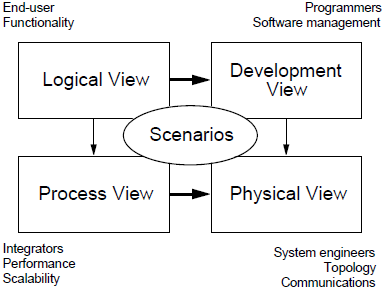
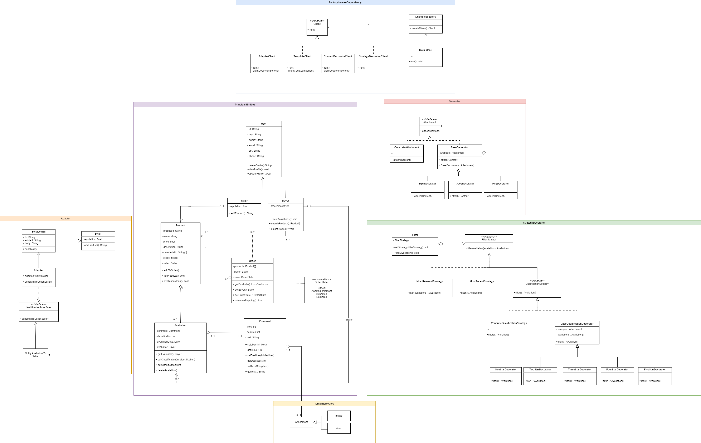
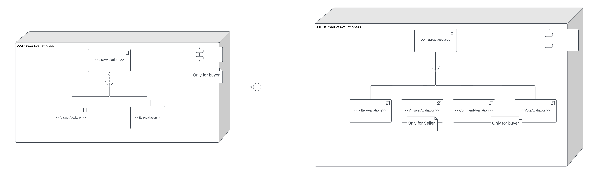

# Documento de arquitetura de software

## 1. Introdução

&emsp;&emsp; No presente documento, abordamos como a arquitetura do software no contexto do fluxo de avaliações do Mercado Livre ficaria em nossa concepção, abordando conceitos aprendidos em sala. Esse Documento utiliza um modelo de arquitetura de software 4 + 1 descrita na Figura 1, para descrever uma visão ampla da arquitetura a todos stakeholders da mesma, bem como lidamos com diferentes requisitos funcionais e não-funcionais.

Modelo 4 + 1   Autor: Autor: P. B. Kruchten

### 1.1 Propósito

&emsp;&emsp; O propósito deste Documento de Arquitetura de Software (DAS) é fornecer uma visão geral da arquitetura do sistema de Avaliação de Produtos do Mercado Livre. Ele descreve as decisões e diretrizes arquiteturais adotadas para garantir um design robusto, escalável e de fácil manutenção. O DAS também serve como referência para a equipe de desenvolvimento e outras partes interessadas, ajudando a garantir a consistência e compreensão compartilhada da arquitetura do software.

### 1.2 Escopo

&emsp;&emsp; Este DAS abrange a arquitetura do aplicativo de Avaliação de Produtos do Mercado Livre. Ele inclui a estrutura geral do sistema, as principais componentes, interfaces, fluxos de informação e as interações entre os diversos módulos do software.

&emsp;&emsp; Adotamos o mapa mental como uma abordagem inicial para definir o escopo do projeto, a equipe pode realizar uma sessão de brainstorming para identificar e listar os diferentes aspectos relacionados ao sistema em desenvolvimento. Os membros da equipe podem contribuir com suas perspectivas e conhecimentos para adicionar elementos importantes ao mapa mental. Segue abaixo o mapa mental em sua versão final.

<iframe width="768" height="432" src="https://miro.com/app/live-embed/uXjVMR5ENS8=/?moveToViewport=-42705,493,30166,23057&embedId=786895539513" frameborder="0" scrolling="no" allow="fullscreen; clipboard-read; clipboard-write" allowfullscreen></iframe>

Mapa mental   Autor: Todos integrantes

### 1.3 Definições

- DAS (Documento de Arquitetura de Software): Documento que descreve a arquitetura de software de um sistema, incluindo decisões arquiteturais, componentes e suas interações.

### 1.4 Visão Geral

&emsp;&emsp; O documento apresenta as decisões arquiteturais para o fluxo de avaliação do mercado livre voltadas para o perfil plataforma e o perfil comprador, que compreendende todo o fluxo e interação dos participantes com as avaliações do mercado livre, envolvendo alguns artefatos já desenvolvidos durante a disciplina de Arquitetura e Desenho de Software e artefatos fundamentais para o entendimento da arquitetura do sistema.

## 2. Representação arquitetural

&emsp;&emsp; Abaixo, listamos quais foram os diagramas construídos ao longo do semestre.

### 2.1 Diagrama de classes

&emsp;&emsp; Abaixo mostramos o nosso [Diagrama de classes](https://unbarqdsw2023-1.github.io/2023.1_G2_ProjetoMercadoLivre/#/Modelagem/Estaticos/classes), que é uma representação visual das classes, interfaces, atributos e métodos que compõem nosso fluxo de avaliação de produto do Mercado Livre.

### 2.2 Diagrama de pacotes

&emsp;&emsp; Um [Diagrama de Pacotes](https://unbarqdsw2023-1.github.io/2023.1_G2_ProjetoMercadoLivre/#/Modelagem/Estaticos/pacotes) é um diagrama estrutural definido pela UML que descreve os pacotes ou pedaços do sistema divididos em agrupamentos lógicos mostrando as dependências entre eles. Este diagrama é muito utilizado para ilustrar a arquitetura de um sistema mostrando o agrupamento de suas classes .

### 2.3 Diagrama de estados

&emsp;&emsp; O [Diagrama de estados](https://unbarqdsw2023-1.github.io/2023.1_G2_ProjetoMercadoLivre/#/Modelagem/Dinamicos/estados) é uma representação visual que descreve os diferentes estados que um objeto ou sistema pode assumir e as transições entre esses estados. É uma ferramenta amplamente utilizada na modelagem e no design de sistemas, auxiliando no entendimento e na comunicação das interações e comportamentos de um sistema.

### 2.4 Diagrama de colaboração

&emsp;&emsp; Abaixo, apresentamos os [Diagrama de colaboração](https://unbarqdsw2023-1.github.io/2023.1_G2_ProjetoMercadoLivre/#/Modelagem/Dinamicos/colaboracao), que é uma ferramenta visual utilizada na modelagem de sistemas para ilustrar a interação entre os objetos envolvidos em um determinado cenário ou processo. O objetivo destes diagramas é representar como os objetos colaboram entre si, trocando mensagens e compartilhando informações para realizar uma tarefa específica. No contexto do nosso projeto, elaboramos o diagrama com base nas interações entre o vendedor, o comprador e a plataforma, considerando o fluxo de avaliação em situações específicas definidas.

### 2.5 Diagrama de Componentes

&emsp;&emsp;O diagrama de componentes é um tipo de diagrama que representa visualmente a estrutura e as dependências dos componentes de um sistema, mostrando como eles se relacionam entre si. Os componentes identificados pelo grupo na criação do diagrama de componentes foram traduzidos de funções encontradas pela [Rich Picture](https://unbarqdsw2023-1.github.io/2023.1_G2_ProjetoMercadoLivre/#/Base/richPicture) feito pelo grupo, com a finalidade de mapear o que é necessário para que o sistema implementasse a funcionalidade de avaliação de produtos do Mercado Livre.

## 3. Objetivos e restrições arquiteturais

&emsp;&emsp; Os objetivos arquiteturais representam as metas que a arquitetura do software deve alcançar, como escalabilidade, flexibilidade, modularidade, desempenho, entre outros. Esses objetivos definem a direção e os resultados desejados para a arquitetura, fornecendo uma base para as decisões arquiteturais. Segue abaixo uma breve explicação e possível solução para cada meta listada anteriormente.

### Escalabilidade

&emsp;&emsp; Para favorecer a escalabilidade de um projeto do mercado livre, uma solução eficaz é adotar uma arquitetura escalável e distribuída, juntamente com o uso de serviços em nuvem.

#### Possível solução

&emsp;&emsp; Balanceamento de carga: Distribua o tráfego de entrada por meio de técnicas de balanceamento de carga para distribuir a carga de trabalho entre diferentes instâncias do serviço, garantindo uma distribuição equilibrada e prevenindo sobrecargas em servidores específicos.

&emsp;&emsp; Um exemplo de balanceador de carga é o HAProxy. O HAProxy é um software de balanceamento de carga de código aberto que oferece recursos avançados e alta performance. ele começará a distribuir as solicitações entre os servidores backend definidos. O HAProxy oferece vários algoritmos de balanceamento, como round-robin, leastconn, source, entre outros, permitindo que você ajuste a forma como o tráfego é distribuído.

<figcaption align='center'>
    <b>Figura 1: Aplicação sem balanço de carga</b>
     <small>Fonte: Cloudflare</small>
</figcaption> 

<figcaption align='center'>
    <b>Figura 2: Aplicação com balanço de carga</b>
     <small>Fonte: Cloudflare</small>
</figcaption> 

### Flexibilidade

&emsp;&emsp;Para favorecer a flexibilidade do sistema, ou seja, que ele seja capaz de se adaptar e evoluir com mais facilidade, algumas boas práticas são desejadas para isso, como:

- **Modularidade:** Dividir o sistema em módulos independentes e coesos, onde cada módulo possui uma responsabilidade claramente definida, permitindo que alterações sejam feitas em módulos isolados, sem afetar todo o sistema.
- **Padrões de projeto:** Padrões de projeto reconhecidos pode promover a flexibilidade do sistema. Padrões como Injeção de Dependência, Strategy, Decorator e adapter que foram utilizados em nosso projeto podem permitir a alteração do comportamento do sistema sem modificar seu núcleo.
- **Sistema em camadas:** Essa arquitetura divide o sistema em camadas (por exemplo, camada de apresentação, camada de lógica de negócios, camada de persistência) permitindo separar as preocupações e facilita a modificação e a substituição de componentes específicos, foi utilizado em nosso projeto na separação do [Diagrama de Pacotes](https://unbarqdsw2023-1.github.io/2023.1_G2_ProjetoMercadoLivre/#/Modelagem/Estaticos/pacotes).

### Modularidade

&emsp;&emsp;Para garantir a modularidade do sistema, é preciso adotar práticas e abordagens que promovam a separação de responsabilidades e a organização em componentes independentes, algumas boas práticas são desejadas para isso, como:

- **Baixo acoplamento:** Reduz as dependências entre os módulos, evitando acoplamento forte entre eles, a adoção de padrões de projeto ajudam nisso, como utilizamos em nosso projeto.
- **Separação de preocupações:** Dividindo o sistema em módulos que abordam preocupações separadas. Por exemplo, separando a camada de apresentação, a lógica de negócios e a camada de persistência em módulos distintos. Isso facilita a compreensão, a manutenção e a evolução de cada parte do sistema, além de permitir que diferentes módulos sejam desenvolvidos, testados e implantados de forma independente. Em nosso projeto separamos como mostrado no [Diagrama de Pacotes](https://unbarqdsw2023-1.github.io/2023.1_G2_ProjetoMercadoLivre/#/Modelagem/Estaticos/pacotes).

### Desempenho

&emsp;&emsp; O fator desempenho é um dos aspectos essenciais na arquitetura de software, pois está diretamente relacionado à eficiência e velocidade com que um sistema realiza suas operações. Ele se refere à capacidade do software de responder de maneira rápida e eficiente às solicitações dos usuários, processar e fornecer resultados em tempo hábil. Um bom desempenho é crucial para garantir a satisfação dos usuários.

#### Possíveis soluções

- **Paginação de Avaliações:** Suponha que o objetivo seja exibir as avaliações de um produto em uma página de detalhes do produto. Em vez de exibir todas as avaliações em uma única página, é possível implementar a paginação para exibir um número limitado de avaliações por página. Por exemplo, exibir 10 avaliações por página e fornecer links de páginação para permitir que o usuário navegue entre as diferentes páginas de avaliações.

- **Cache de avaliações:** Para evitar consultar o banco de dados repetidamente para recuperar as mesmas avaliações, é possível implementar um cache de avaliações. Por exemplo, ao exibir as avaliações de um produto, é feita uma verificação se as avaliações já estão armazenadas em cache em memória. Se estiverem, é possível recuperá-las diretamente do cache, evitando a necessidade de acessar o banco de dados.

&emsp;&emsp; Por sua vez, as restrições arquiteturais são as limitações impostas ao projeto, como restrições de orçamento, prazos, tecnologias existentes, padrões corporativos e requisitos regulatórios. Essas restrições moldam as decisões arquiteturais, influenciando a escolha de componentes, tecnologias e abordagens que sejam viáveis dentro dos limites definidos.

## 4. Visão de casos de uso

As visões arquiteturais de casos de uso desempenham um papel crucial na definição e no entendimento da arquitetura de um sistema de software, descrevendo como os casos de uso identificados no processo de análise de requisitos se relacionam com a estrutura e os componentes do sistema. Ela ajuda a identificar os principais atores, suas interações com o sistema e os fluxos de informações envolvidos.

Ao criar uma visão arquitetural de casos de uso, os arquitetos de software podem visualizar e comunicar de forma clara como o sistema irá atender às necessidades dos usuários, facilitando a tomada de decisões arquiteturais e o alinhamento entre os requisitos e o design do sistema.

### 4.1. Casos de uso

#### Participantes

|    Participante    |
| :----------------: |
|    Adne Moretti    |
|  Gabriel Moretti   |
| Leonardo Vitoriano |
|   Letícia Aires    |

Para confeccionar os casos de uso, foi realizada uma reunião entre os integrantes do grupo para realizar uma discussão sobre a criação e organização de seus elementos, também com as relações entre eles. Durante a reunião, foram criados os seguintes casos de uso:

### 4.1.1 Tabelas e diagrama de casos de uso

#### Atores

| Número |    Ator    |                              Descrição                              |
| :----: | :--------: | :-----------------------------------------------------------------: |
|   1    | Comprador  | Usuário comprador de produtos e avaliador no site do Mercado Livre  |
|   2    |  Vendedor  | Usuário vendedor de produtos e mantenedor no site do Mercado Livre  |
|   3    | Plataforma | Plataforma do Mercado Livre, responsável pelo gerenciamento do site |

#### Tabela de itens

| Código |      Descrição      |
| :----: | :-----------------: |
|  US01  |    Vende produto    |
|  US02  |   Compra produto    |
|  US03  |  Visualiza produto  |
|  US04  |  Realiza avaliação  |
|  US05  | Preenche formulário |
|  US06  |   Relata problema   |
|  US07  | Realiza comentário  |
|  US08  | Responde comentário |
|  US09  | Visualiza avaliação |
|  US10  |  Vota em avaliação  |
|  US11  |  Modera avaliação   |
|  US12  |  Exclui avaliação   |
|  US13  |   Edita avaliação   |
|  US14  |  Filtra avaliações  |
|  US15  |  Notifica vendedor  |
|  US16  | Notifica comprador  |
|  US17  |   Indica produto    |

#### Tabela de dependências

|   Relação   |  Tipo  |
| :---------: | :----: |
| US05 X US04 | EXTEND |
| US06 X US05 | EXTEND |
| US07 X US05 | EXTEND |
| US12 X US11 | EXTEND |

#### Diagrama de casos de uso

  
  

    <h6 style="text-align: flex;">
    Figura 8 : Diagrama de casos de uso V1
    </h6>
  

  
  

    <h6 style="text-align: flex;">
    Figura 9 : Diagrama de casos de uso V2
    </h6>
  

## 5. Visão lógica

&emsp;&emsp;A visão lógica de um documento arquitetural de software descreve a estrutura interna do sistema e como seus diferentes componentes se relacionam entre si de forma lógica. Essa visão tem como objetivo principal fornecer uma representação abstrata do sistema, destacando os principais elementos funcionais e suas interações.

### 5.1 Visão Geral

&emsp;&emsp;A visão lógica concentra-se nos conceitos e nas funcionalidades do software, em vez de detalhar aspectos técnicos ou físicos da implementação. Ela ajuda a entender a organização geral do sistema, suas principais características e a lógica por trás do seu funcionamento.

### 5.2 Pacotes de design arquitetonicamente significativos

Para o nosso projeto utilizamos a visão lógica nos seguintes diagramas:

<figcaption align='center'>
    <b>Figura 1: Diagrama de Classes</b>
     <small>Fonte: Elaboração Própria</small>
</figcaption> 

- [Diagrama de classes](https://unbarqdsw2023-1.github.io/2023.1_G2_ProjetoMercadoLivre/#/Modelagem/Estaticos/classes)

  - Para o diagrama de classes, buscamos dividir o fluxo de avaliação do sistema do Mercado Livre, da melhor forma pelo que entendemos, utilizando os seguites padrões de projeto:
    - Adapter;
    - Decorator;
    - Strategy e decorator juntos;
    - Template method;
    - Factory e inversão de dependêncial
  - O ponto central dessa Arquitetura roda em cima da Classe Avaliation, pois é ela que armazena todo conteúdo de uma avaliação, que representa o intuito do nosso sistema.

    

    
    <figcaption align='center'>
      <b>Figura 2: Diagrama de Pacotes</b>
       <small>Fonte: Elaboração Própria</small>
  </figcaption> 

  

- [Diagrama de Pacotes](https://unbarqdsw2023-1.github.io/2023.1_G2_ProjetoMercadoLivre/#/Modelagem/Estaticos/pacotes)
  - Para o Diagrama de pacotes dividimos em 3 Grandes pacotes, Onde há 3 Pacotes principais do software que São:
    - Client: o Client é o pacote que mostra como o usuário se conecta com a aplicação, para a nossa motivação, Avalição do Mercado Livre, por web ou por mobile.
    - Application: É o pacote onde possui o Front-end e o Back-end do sistema
    - Database: O pacote Database representa a base de dados do sistema, onde é modelado tabelas de acordo com as principais classes que regem a regra de negócio construídas no diagrama de classes. São elas: Order, Product, User, Seller, Buyer, Avaliation e Comment.

  
  

    <h6 style="text-align: flex;">
    Figura 4 : Interação de avaliação comprador pré-compra
    </h6>
  

  
  

    <h6 style="text-align: flex;">
    Figura 5 : Interação de avaliação comprador pós-compra
    </h6>
  

  
  

    <h6 style="text-align: flex;">
    Figura 6 : Interação de avaliação vendedor pós-compra
    </h6>
  

  
  

    <h6 style="text-align: flex;">
    Figura 7 : Interação de avaliação plataforma 
    </h6>
  

- [Diagrama de colaboração](https://unbarqdsw2023-1.github.io/2023.1_G2_ProjetoMercadoLivre/#/Modelagem/Dinamicos/colaboracao)
  - Para mostrar como objetos relacionam-se uns com os outros, dividimos em 4 diagramas que representam a interação entre os objetos envolvidos em um determinado cenário ou processo, no nosso sistema, fizemos os seguintes diagramas:
    - Interação comprador pré-compra
    - Interação comprador pós compra
    - Interação vendedor pós compra
    - Interação plataforma

<iframe allowfullscreen frameborder="0" style="width:640px; height:480px" src="https://lucid.app/documents/embedded/06f05d2e-62cb-4351-a339-0fa45449264d" id="BvjYAfOoeRZi"></iframe>

<figcaption align='center'>
    <b>Figura 3: Diagrama de estados</b>
     <small>Fonte: Elaboração Própria</small>
</figcaption> 

- [Diagrama de estados](https://unbarqdsw2023-1.github.io/2023.1_G2_ProjetoMercadoLivre/#/Modelagem/Dinamicos/estados)
  - Para descrever diversos aspectos relacionados a transições de estados que um objeto pode ter realizamos um diagrama de Estados contendo dois fluxos Principais:
    - Fluxo do Produto, que descreve os estados que um produto, por mais que não represente o fluxo principal da aplicação representa o ponto de partida para o fluxo de avaliação do Mercado Livre.
    - Fluxo de Avaliação, representa os Estados chave da aplicação do fluxo de avaliação do Mercado Livre.

## 6. Visão de processo

&emsp;&emsp;A visão de processos refere-se a uma perspectiva da arquitetura que descreve como os processos e as tarefas do sistema de software são organizados e interagem entre si. Essa visão tem como objetivo identificar os principais processos do sistema e entender como eles se comunicam, coordenam e compartilham recursos. Esta visão é essencial para compreender e modelar a forma como os diferentes componentes e módulos interagem para atingir os objetivos do sistema.

&emsp;&emsp;Essa perspectiva permite identificar as entradas, saídas e os fluxos de informações dentro do software, além de mapear as responsabilidades de cada componente. A visão de processos no DAS facilita a análise de desempenho, a identificação de gargalos e a otimização do fluxo de trabalho. Com ela, é possível garantir a eficiência, a escalabilidade e a manutenibilidade do software, tornando-o mais robusto e adaptável às necessidades do negócio.

&emsp;&emsp;Em nosso projeto, fizemos o seguinte diagrama para demonstrar essa visão:

  
  

    <h6 style="text-align: flex;">
    Figura X : Diagrama de Processos
    </h6>
  

## 7. Visão de implementação

&emsp;&emsp; A visão de implementação descreve a organização de módulos de software estáticos (código-fonte, arquivos de dados, executáveis, documentação etc.) no ambiente de desenvolvimento em termos de:

- Embalagem e camadas
- Gerenciamento de configuração (propriedade, estratégia de liberação etc.)

Vale também lembrar que a visão de implementação concentra-se em transformar a visão lógica e suas entidades e dividí-las em componentes reais de software.

### 7.1. Visão geral

&emsp;&emsp; Os componentes identificados pelo grupo para a criação do diagrama UML de componentes foram traduzidos de funções identificadas previamente na produção do [Rich Picture](https://unbarqdsw2023-1.github.io/2023.1_G2_ProjetoMercadoLivre/#/Base/richPicture) com a finalidade de mapear o que é necessário para que o sistema implemente a funcionalidade de avaliação de produtos comprados.

### 7.2. Diagrama de componentes

## 8. Visão de Dados

&emsp;&emsp; A visão de Dados se concentra na estrutura e organização dos dados persistentes utilizados pelo sistema. Ela descreve como os dados são armazenados, acessados e manipulados, incluindo as entidades de dados, seus atributos e relacionamentos.

### 8.1. Modelo Entidade-Relacionamento (ME-R)

&emsp;&emsp; Um modelo entidade-relacionamento (MER) é um tipo de modelo de dados usado para representar a estrutura e os relacionamentos entre as entidades de um sistema. Ele fornece uma representação visual das entidades, seus atributos e as associações entre elas.

&emsp;&emsp; No modelo entidade-relacionamento, as entidades são representadas como retângulos e os relacionamentos são representados como linhas que conectam as entidades. Cada entidade possui atributos que descrevem características específicas dela. Segue abaixo, o nosso modelo.

### Entidades

- USER
- BUYER
- SELLER
- ORDER
- PRODUCT
- COMMENT
- AVALIATION

### Descrição das Entidades

- USER ( cpfUser, address(cep, street, number, neighborhood, city, state), name, email, {phone} )
- BUYER ( idBuyer, orderAmount, cpfUser )
- SELLER (idSeller, reputation, cpfUser)
- ORDER ( idOrder, state, idBuyer, idProduct)
- PRODUCT (idProduct, name, price, description, characteristics, stock, idSeller)
- COMMENT (idComment, likes, dislikes, text)
- AVALIATION (idAvaliation, avaliationDate, classification, idComment)

### Descrição dos relacionamentos

- AVALIATION **- has -** COMMENT  
  One AVALIATION can have only one COMMENT, and one COMMENT can belong to one AVALIATION.

  Cardinality: **(1:1)**

- SELLER **- sell -** PRODUCT 
  One SELLER can sell one or more PRODUCTs, and one PRODUCT can be sold by one SELLER.

  Cardinality: **(1:n)**

- BUYER **- buy -** PRODUCT 
  One BUYER can buy one or more PRODUCTs, and one PRODUCT can be bought by one or more BUYERs.

  Cardinality: **(n:m)**

- ORDER **- owns -** PRODUCT  
  One ORDER can owns one or more PRODUCTs, and one PRODUCT can belong to one or more ORDERs.

  Cardinality: **(n:m)**

- BUYER **- creates -** AVALIATION 
  One BUYER can create one or more AVALIATIONs, and one AVALIATION can be created by only one BUYERs.

  Cardinality: **(n:1)**

### 8.2. Diagrama Entidade-Relacionamento (DE-R)

  
  

    <h6 style="text-align: flex;">
    Figura 8: DE-R
    </h6>
  

### 8.3. Diagrama Lógico de Dados (DLD)

  
  

    <h6 style="text-align: flex;">
    Figura 8: DLD
    </h6>
  

## 9. Tamanho e performance

&emsp;&emsp; Fizemos uma aplicação executada localmente, usando a linguagem TypeScript para o desenvolvimento dos padrões de projeto, onde no total, a aplicação possui 31,22 MegaBytes, e roda nos principais sistemas operacionais, Linux, Windows e MacOs.

Os requisitos mínimos para a execução são:

- Ter o node.js instalado na máquina na versão 16.20.0;

&emsp;&emsp; Para falamos de tamanho e performance não há como não associar ao termo Escalabilidade. Escalabilidade é a capacidade de um sistema ou processo lidar com uma grande quantidade de trabalho, e com performance. Existem alguns tipos que são relevantes para o mercado livre.

&emsp;&emsp; Escalabilidade horizontal onde aumentamos a quantidade de maquinas no sistema. Para o caso do mercado livre imaginamos que é preciso ter um Serviço que permita o aumento da quantidade de dados armazenados então algumas soluções como o serviço da AWS Amazon S3, por exemplo, permite uma solução escalável e inclusive renovável já que serviços em cloud segundo uma pesquisa no data center LocalWeb, aponta algumas vantagens de utilizar serviços em cloud como menor consumo de energia, espaço físico e, uso racional dos recursos naturais (Pinto, Campos, Azevedo, 2021).

&emsp;&emsp; Elasticidade: refere-se a habilidade de um sistema escalar de forma variável de acordo com a demanda, Para o mercado livre é muito importante lidar com essas picos e baixos de acesso de forma estável, então soluções como serviço da AWS Amazon S3, também possuem essa habilidade sendo a própria AWS o gerenciador do dimensionamento do serviço.

## 10. Qualidade

&emsp;&emsp; Para falamos de tamanho e performance não há como não associar ao termo Escalabilidade. Escalabilidade é a capacidade de um sistema ou processo lidar com uma grande quantidade de trabalho, e com performance. Existem alguns tipos que são relevantes para o mercado livre.

&emsp;&emsp; A Escalabilidade de dados é a capacidade de um sistema lidar com um aumento no volume de dados sem comprometer seu desempenho. É um conceito-chave na qualidade de software, permitindo que um sistema cresça e se adapte às necessidades em constante mudança. Para alcançar a escalabilidade de dados, é necessário considerar o armazenamento eficiente, a capacidade de processamento e a distribuição de carga. Isso é essencial para garantir que o sistema possa lidar com grandes quantidades de dados sem afetar sua performance.

&emsp;&emsp; Escalabilidade horizontal onde aumentamos a quantidade de maquinas no sistema. Para o caso do mercado livre imaginamos que é preciso ter um Serviço que permita o aumento da quantidade de dados armazenados então algumas soluções como o serviço da AWS Amazon S3, por exemplo, permite uma solução escalável e inclusive renovável já que serviços em cloud segundo uma pesquisa no data center LocalWeb, aponta algumas vantagens de utilizar serviços em cloud como menor consumo de energia, espaço físico e, uso racional dos recursos naturais (Pinto, Campos, Azevedo, 2021).

&emsp;&emsp; A escalabilidade vertical, é a capacidade de um sistema lidar com um aumento na demanda ou carga de trabalho do sistema, fornecendo mais recursos ao componente existente. Por exemplo, se um servidor estiver sobrecarregado e lento devido a um aumento no tráfego de usuários, a escalabilidade vertical envolveria a adição de mais CPU, RAM ou outros recursos para lidar com a carga adicional. Em um cenário on-premise, essa adição seria física, aumentando a capacidade do hardware. No cenário cloud, a escabilidade vertical é mais dinámica, uma vez que o poder computacional é virtualmente ilimitado. No ambiente clound é também possível que essa escalabilidade seja automática para suprir a demanda do momento.

&emsp;&emsp; Elasticidade: refere-se a habilidade de um sistema escalar de forma variável de acordo com a demanda, Para o mercado livre é muito importante lidar com essas picos e baixos de acesso de forma estável, então soluções como serviço da AWS Amazon S3, também possuem essa habilidade sendo a própria AWS o gerenciador do dimensionamento do serviço.

Para o projeto visamos utilizar o modelo de qualidade ISO/IEC 25010, que determina características e subcaracterísticas relevantes para o produto de software.

- **Extensabilidade**: Com a adoção de padrões de projeto que utilizamos em nosso projeto e a reutilização de código, a aplicação pode ser facilmente adaptada para atender a novos requisitos ou adicionar funcionalidades extras no futuro.

- **Portabilidade**: Como descrevemos no [Diagrama de Pacotes](https://unbarqdsw2023-1.github.io/2023.1_G2_ProjetoMercadoLivre/#/Modelagem/Estaticos/pacotes) onde há um pacote de Client, que representa um consumo dos serviços utilizados pela Application, indicando que o sistema deve possuir a subcaracteristica **Adaptabilidade**, então o sistema deve poder se adaptar entre diferentes sistemas operacionais e hardwares.
- **Segurança**: Para a seguraça é importante que o sistema proporcione **Confidencialidade** ,**Autenticidade** **Integridade**, pois para esse fluxo de Avaliação do Mercado Livre lidamos com dados dos Usuário, descritos na Lei Geral de Proteção de Dados Pessoais (LGPD), Lei n° 13.709/2018, que trata de dados pessoais, dispostos em meio físico ou digital, feito por pessoa física ou jurídica de direito público ou privado.
- **Manutenabilidade**: Como desenvolvemos uma estrutura de pacotes onde cada módulo possui alguns graus de dependencia e que camadas de maior baixo nível não devem depender de camadas de nível maior, como descrevemos no [Diagrama de Pacotes](https://unbarqdsw2023-1.github.io/2023.1_G2_ProjetoMercadoLivre/#/Modelagem/Estaticos/pacotes), onde a Camada de Data não deve depender do Controlador, isso representa a subcaracteristicas **Modularidade**.

## 11. Histórico de versão

| Versão |                       Alteração                       |                   Responsável                   | Revisor | Data  |
| :----: | :---------------------------------------------------: | :---------------------------------------------: | :-----: | :---: |
|  1.0   |              Criando escopo do documento              | João Henrique, Adne Moretti , Marcos e Leonardo | Cicero  | 28/06 |
|  2.0   |      Adicionando modelo entidade relacionamento       |     João Henrique, Adne Moretti e Leonardo      | Arthur  | 28/06 |
|  3.0   |                Adicionando DE-R e DLD                 |               Leonardo Vitoriano                | Marcos  | 30/06 |
|  3.1   |           Adicionando visão de casos de uso           |        Adne, Gabriel, Leonardo, Letícia         | Cícero  | 30/06 |
|  3.2   |          Adicionando início da Visão lógica           |                  João Henrique                  | Gabriel | 01/07 |
|  3.3   |               Refatorando Visão Lógica                |              João Henrique, Arthur              | Cícero  | 01/07 |
|  4.0   |                 Adicionando Qualidade                 |              João Henrique, Arthur              |  Adne   | 01/07 |
|  4.1   |         Adicionando explicação do que é o MER         |                     Marcos                      |  Adne   | 02/07 |
|  4.2   |         Adicionando versão 2 dos casos de uso         |                     Gabriel                     | Letícia | 03/07 |
|  4.3   |           Adicionando Tamanho e performance           |                  João Henrique                  | Matheus | 03/07 |
|  4.4   |          Adicionando o mapa mental ao escopo          |                     Marcos                      | Cícero  | 03/07 |
|  4.5   | Organizando Visão Lógica e representação arquitetural |             João Henrique e Marcos              | Cícero  | 03/07 |
|  5.0   |   Adicionando Objetivos e restrições arquiteturais    |             João Henrique e Marcos              | Arthur  | 03/07 |
|  5.1   |                 Melhorando introdução                 |                     Arthur                      | Marcos  | 03/07 |
| 5.2 | Adicionando Escalabilidade horizontal e elasticidade | Arthur | João | 03/07 |
| 5.3 | Adicionando texto para diagrama de processos | Cícero | Gabriel | 03/07 |
| 5.4 | Escalabilidade de dados | Thiago Gomes | Christian Fleury | 03/07 |
| 5.5 | Adicionando escalabilidade vertical | Christian Fleury | Thiago Gomes | 03/07 |
| 5.6 | Adicionando do diagrama de processos | Gabriel | Cícero | 03/07 |

## 13 Referências

- [ISO/IEC 25010](https://iso25000.com/index.php/en/iso-25000-standards/iso-25010);
- [Class notes, University of Victoria](https://www.ece.uvic.ca/~itraore/seng422-05/notes/arch05-5.pdf);
- P. B. Kruchten, "The 4+1 View Model of architecture," in IEEE Software, vol. 12, no. 6, pp. 42-50, Nov. 1995, doi: 10.1109/52.469759.
- [3] https://www.devmedia.com.br/reutilizacao-de-software-revista-engenharia-de-software-magazine-39/21956;
- PINTO, MARCOS MF, PATRÍCIA KLINKERFUS DE CAMPOS, and VIVIANE RAMALHO DE AZEVEDO. "SUSTENTABILIDADE DE DATA CENTERS COM O USO DA TI-VERDE." Revista Científica e-Locução 1.20 (2021): 18-18.
- A. -P. Barzu, M. Barbulescu and M. Carabas, "Horizontal scalability towards server performance improvement," 2017 16th RoEduNet Conference: Networking in Education and Research (RoEduNet), Targu-Mures, Romania, 2017, pp. 1-6, doi: 10.1109/ROEDUNET.2017.8123729.
