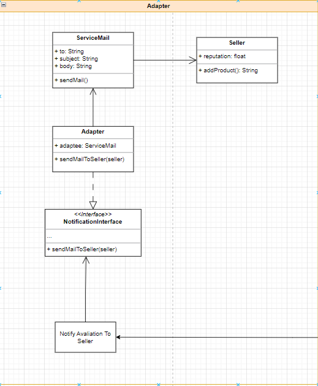

# Módulo de reutilização de software

## 1. Introdução

&emsp;&emsp;A reutilização de software consiste em aproveitar conceitos, produtos ou soluções existentes para criar novos softwares, com o objetivo de aprimorar a qualidade e a produtividade. Esse processo envolve a utilização de partes de sistemas anteriores, tais como especificações, módulos, arquitetura e código-fonte. A reutilização tem como meta principal elevar a qualidade e reduzir o tempo de desenvolvimento. Pode ser aplicada em diferentes etapas do ciclo de desenvolvimento, como requisitos, design e implementação. Atualmente, há várias técnicas de reuso disponíveis, tais como o uso de frameworks, a adoção de arquiteturas orientadas a serviços (SOA) e a prática de engenharia de software baseada em componentes.

## 2. Backend

### 2.1 Notificação - Adapter

#### 2.1.1 - Análise de HotsSpots e FrozenSpots

Uma breve introdução dos termos, Hotspots são áreas de um software que são mais propensas a mudanças, normalmente apresentando alta complexidade e alto acoplamento. Essas áreas estão sujeitas a alterações frequentes devido a requisitos em constante evolução, mudanças no ambiente ou outros fatores. Identificar hotspots é importante para direcionar esforços de manutenção e refatoração para as áreas mais críticas do sistema. Já FrozenSpots são áreas de baixo acoplamento e baixa complexidade, são areas do software que raramente mudam.

<figcaption align='center'>
    <b>Figura 1: Representação Design Pattern Adapter representado no diagrama de classes</b>
     <small>Fonte: Elaboração Própria</small>
</figcaption> 

No contexto do Adapter, a classe ServiceMail representa um **hotspot** porque é responsável por fornecer um serviço de envio de e-mails para os Sellers. Como geralmente os serviços de e-mail são delegados a pacotes terceiros ou serviços externos, a classe ServiceMail pode depender tanto da classe Seller quanto de pacotes ou APIs externas. Isso significa que qualquer alteração nos pacotes terceiros ou nas dependências externas pode afetar as mudanças necessárias na classe ServiceMail.

Em relação à classe Seller, ela representa uma entidade e, dificilmente mudará. As entidades são tipicamente consideradas como parte das camadas mais baixas da arquitetura, como a camada de domínio ou a camada de persistência. Essas classes são independentes de classes de níveis superiores e tendem a ter menor dependência em relação a outras classes de alto nível.

Como a classe Seller está em camadas de baixo nível, ela é menos propensa a depender de outras classes de alto nível, o que a torna menos suscetível a mudanças resultantes de alterações de classes em camadas de alto nível, portanto representa um possível **FrozenSpot**, da aplicação.

Concluindo temos que, a classe ServiceMail representa um hotspot devido às suas dependências de alto nível, como a classe Seller e pacotes terceiros. A classe Seller representa um FrozenSpot, por ser uma entidade em camadas mais baixas, tende a ser mais estável e ter menor dependência em relação a outras classes de alto nível.

    import { injectable } from 'inversify';
    import { Client } from '../interfaces/Client.js';
    import EmailAdapter from './EmailAdapter.js';
    import EmailServiceImpl from './EmailService.js';
    import EmailUseCase from './EmailUseCase.js';

    @injectable()
    export default class AdapterClient implements Client {
    private clientCode() {
        const emailService = new EmailServiceImpl();

        const emailAdapter = new EmailAdapter(emailService);

        const emailUseCase = new EmailUseCase(emailAdapter);

        emailUseCase.sendEmailToUser('teste@gmail.com', 'Nova venda!', {
        sellerName: 'Jairo',
        productName: 'Iphone 11',
        });
    }

    run(): void {
        this.clientCode();
        console.log('\n');
        }
    }

### 2.2 Anexos - Decorator

Durante a etapa de construção dos padrões de projeto GoFs, optamos pelo uso do padrão estrutural Decorator, também conhecido como "Wrapper", em Typescript, a fim de permitir, dinamicamente, a adição de novas responsabilidades a um objeto, sem que sua base seja modificada. Isto é, implementando funcionalidades extras e mantendo seu código-fonte original.

Nesse sentido, a implementação visa lidar com diferentes tipos de anexo, como JPG, PNG e MP4, tendo em mente o fito de tornar o código mais legível, evitar duplicação, além comprimir arquivos de imagem, converter formatos de áudio e extrair metadados.

Por fim, tem-se que o Decorator promove a modularidade, flexiblidade e reutilização do código ao permitir a implementação de anexos de arquivos às avaliações e mantendo o código original por meio do BaseDecorator.ts e suas classes relacionadas: Mp4Decorator, JpegDecorator e PngDecorator.

<figcaption align='center'>
    <b>Figura 1: Representação Design Pattern Decorator representado no diagrama de classes</b>
     <small>Fonte: Elaboração Própria</small>
</figcaption> 

    import Avaliation from '../Avaliation';
    import BaseQualificationDecorator from '../baseDecorator/BaseQualificationDecorator.js';

    export default class FiveStarsDecorator extends BaseQualificationDecorator {
    filter(): Avaliation[] {
        const avaliations = super
        .filter()
        .filter((avaliation) => avaliation.classification === 5);
        return avaliations;
    }
    }

### 2.3 Filtros - Strategy e Decorator

Ao longo da fase de "Padrões de Projeto GoFs", foi desenvolvido uma combinação de Padrões, **Strategy** e **Decorator**, visando implementar as funcionalidades de filtragem de avaliação dos produtos do Mercado Livre.

Baseado Figura 1 de Diagrama de Classes, é possível identificar os seguintes classes **Hot-Spots**: FilterStrategy, QualificationStrategy e BaseQualificationDecorator. É possivel considerá-las **Hot-Spots** pois são componentes genéricos, sendo adaptáveis as necessidades das aplicações no geral

<figcaption align='center'>
    <b>Figura 2: Diagrama do padrão Strategy e Decorator para a funcionalidade de filtrar avaliações dos produtos</b>
     <small>Fonte: Elaboração Própria</small>
</figcaption> 

Usando a Linguagem TypeScritp (TS), que é baseada em Orientação a Objetos, e pensando nos componentes e na Reutilização de Software, foi possível importar as classes para o arquivo [StrategyDecoratorClient.ts](https://github.com/UnBArqDsw2023-1/2023.1_G2_ProjetoMercadoLivre/blob/design-patterns/src/strategyDecorator/StrategyDecoratorClient.ts). As classes importadas são reutilizados no decorrer do código, exemplificando as estratégias de filtro: MostRelevantStrategy, MostRecentlyStrategy e ConcreteQualificationStrategy. É importante frisar que os filtros são aplicados na avaliações, ou seja, o módulo Avaliation também é reutilizado.

        import { injectable } from 'inversify';
        import { Client } from '../interfaces/Client.js';
        import Avaliation from './Avaliation.js';
        import Filter from './filter/Filter.js';
        import MostRelevantStrategy from './Strategys/MostRelevantStrategy.js';
        import MostRecentlyStrategy from './Strategys/MostRecentlyStrategy.js';
        import ConcreteQualificationStrategy from './concrete/ConcreteQualificationStrategy.js';
        import FiveStarsDecorator from './decorators/FiveStarsDecorator.js';
        import FourStarsDecorator from './decorators/FourStarsDecorator.js';
        import ThreeStarsDecorator from './decorators/ThreeStarsDecorator.js';
        import TwoStarsDecorator from './decorators/TwoStarsDecorator.js';

        @injectable()
        export default class StrategyDecoratorClient implements Client {
        run(): void {
            const avaliation1 = new Avaliation(new Date(2023, 6, 16), 5, 22);
            const avaliation2 = new Avaliation(new Date(2022, 5, 1), 3, 10);
            const avaliation3 = new Avaliation(new Date(2021, 3, 10), 2, 5);
            const avaliation4 = new Avaliation(new Date(2020, 6, 16), 1, 2);
            const avaliation5 = new Avaliation(new Date(2019, 6, 16), 4, 80);

            const avaliationList: Avaliation[] = [
            avaliation1,
            avaliation2,
            avaliation3,
            avaliation4,
            avaliation5,
            ];

            console.log(
            '------------- Filtrando avaliação por relevancia ---------------'
            );

            const filter = new Filter(new MostRelevantStrategy(), avaliationList);
            filter.filterAvaliation();

            console.log(
            '------------- Filtrando avaliação mais recente ---------------'
            );
            filter.setStrategy(new MostRecentlyStrategy());
            filter.filterAvaliation();

            console.log(
            '--------------- Filtrando por qualificacao - 5 estrelas ------------------'
            );
            const concreteDecorator = new ConcreteQualificationStrategy(avaliationList);
            const fiveStarsDecorator = new FiveStarsDecorator(
            concreteDecorator,
            avaliationList
            );
            filter.setStrategy(fiveStarsDecorator);
            filter.filterAvaliation();

            console.log(
            '--------------- Filtrando por qualificacao - 4 estrelas ------------------'
            );
            const fourStarsDecorator = new FourStarsDecorator(
            concreteDecorator,
            avaliationList
            );
            filter.setStrategy(fourStarsDecorator);
            filter.filterAvaliation();

            console.log(
            '--------------- Filtrando por qualificacao - 3 estrelas ------------------'
            );
            const threeStarsDecorator = new ThreeStarsDecorator(
            concreteDecorator,
            avaliationList
            );
            filter.setStrategy(threeStarsDecorator);
            filter.filterAvaliation();

            console.log(
            '--------------- Filtrando por qualificacao - 2 estrelas ------------------'
            );
            const twoStarsDecorator = new TwoStarsDecorator(
            concreteDecorator,
            avaliationList
            );
            filter.setStrategy(twoStarsDecorator);
            filter.filterAvaliation();
        }
        }

### 2.4 Compressão Arquivos - Template

Durante a etapa de construção dos padrões de projeto GoFs, também foi construído o padrão comportamental template method, em que um esqueleto é construído na classe super porém as subclasses podem redefinir alguns passos dessas construção sobrescrevendo os métodos

Nesse sentido, a implementação visa lidar com diferentes tipos de compressão de dados, tendo o anexo padrão alguns métodos, e alguns deles é o "compressFile" e o "detectExplicitContent", métodos que são herdados por classes filhas e sobrescritos

Um HotSpot pode ser avistado visto que foram métodos projetados para sem genéricos e são adaptados de acordo com a necessidade.

<figcaption align='center'>
    <b>Figura 1: Representação Design Pattern Template method</b>
     <small>Fonte: Elaboração Própria</small>
</figcaption> 

No código citado abaixo, é possível perceber o método templateMethod, que é o esqueleto sendo chamado para duas classes diferentes, que são subclasses de Attachment, e ambas possuem os métodos compressData e detectExplicitContent

    import { injectable } from 'inversify';
    import { Client } from '../interfaces/Client.js';
    import Attachment from './abstract/Attachment.js';
    import Image from './concrete/Image.js';
    import Video from './concrete/Video.js';

    @injectable()
    export default class TemplateClient implements Client {
    private clientCode(Attachment: Attachment) {
        Attachment.templateMethod();
    }

    run(): void {
        this.clientCode(new Image());
        console.log('\n');
        this.clientCode(new Video());
        console.log('\n');
    }
    }

    import Attachment from '../abstract/Attachment.js';

Aqui segue a implementação da classe Attachment

    export default abstract class Attachment {
    public templateMethod(): void {
        this.compressData();
        this.detectExplicitContent();
        this.upload();
    }

    protected upload(): void {
        console.log('Upload geral de Attachment');
    }

    protected abstract compressData(): void;
    protected abstract detectExplicitContent(): void;
    }

Veja também a implementação da subclasse Image, que sobrescreve os métodos já citados anteriormente.

    export default class Image extends Attachment {
    protected compressData(): void {
        console.log('Compressão especifica de Imagem');
    }

    protected detectExplicitContent(): void {
        console.log('Passando pelo detector de conteúdo explícito de Imagem');
    }
    }

## 5. Reutilização Externa

### 5.1 Frameworks

&emsp;&emsp;Um framework é uma estrutura de desenvolvimento de software que visa auxiliar os desenvolvedores na criação de sistemas. Composto por um conjunto de bibliotecas e componentes que permitem o desenvolvimento de forma mais consistente e eficiente.

Os frameworks podem ser classificados como caixa preta, branca ou cinza. Um framework caixa branca temos acesso completo a sua implementação interna e podemos personalizá-lo em detalhes. Já o caixa preta é um elemento que não temos acesso ou conhecimento sobre sua implementação internA. O caixa cinza tem uma parte do caixa branca e do caixa preta.

São um exemplo de reutilização de software, além de possuirem mecanismos para seguir boas práticas e aplicar padrões de projeto no desenvolvimento.

#### 5.2.1 Inversify

No projeto foi utilizao o framework [Inversify](https://inversify.io) para aplicação de um padrão de projeto emergente. O [Inversify](https://inversify.io) é um framework de inversão de controle e injeção de dependência para Javascript/TypeScript.

Fornece uma infraestrutura que permite o gerenciamento e definição das dependências do sistema de forma modular, facilitando a criação de componentes independentes e reutilizáveis. Oferece também um contêiner de injeção de dependência que gerencia as instâncias dos seus componentes e resolve automaticamente as dependências quando necessário.

O [Inversify](https://inversify.io) é considerado um framework cinza, pois permite a personalização de suas funcionalidade conforme necessário, mas ainda existe uma parte que está encapsulada e fora de controle.

<figcaption align='center'>
    <b>Figura 3: Logo do framework invesify</b>
     <small>Fonte: https://inversify.io/</small>
</figcaption> 

#### 5.2.2 NestJS

O [NestJS](https://nestjs.com) é um framework de desenvolvimento de aplicativos em Node.js que combina conceitos do Angular com o Node.js. Ele oferece uma abordagem modular e orientada a serviços, permitindo a criação de aplicativos escaláveis e bem estruturados. Com o NestJS, é possível desenvolver APIs de forma rápida e eficiente, além de facilitar a manutenção e testabilidade do código. Ele é considerado um framework de "caixa branca", pois permite personalização e controle total sobre o código e suas funcionalidades. Sua arquitetura é baseada em módulos, controladores e provedores de serviços, o que facilita a organização e reutilização do código.

<figcaption align='center'>
    <b>Figura 4: Logo do framework nest.js</b>
     <small>Fonte: https://inversify.io/</small>
</figcaption> 

### 5.2 Bibliotecas

&emsp;&emsp;Uma biblioteca de software é um conjunto de código reutilizável que oferece funcionalidades para serem incorporadas em outros programas, permitindo aos desenvolvedores aproveitar o trabalho já feito e evitar a repetição de código.
&emsp;&emsp;As bibliotecas abrangem uma variedade de recursos, como manipulação de dados, comunicação de rede e interface de usuário. As bibliotecas fornecem uma API consistente para acessar suas funcionalidades, sem a necessidade de entender os detalhes de implementação. Podem ser de código aberto ou proprietárias. O uso de bibliotecas acelera o desenvolvimento, promove boas práticas de programação e aumenta a qualidade do software, dessa forma gerando a reutilização de software.

#### 5.2.1 ReactJs

Um exemplo de biblioteca é o [ReactJS](https://react.dev/) que é é uma biblioteca front-end JavaScript de código aberto voltada à criação de interfaces de usuário em páginas web, ela é baseada em componentes, permitindo o reaproveitamento de código e facilitando a manutenção.

<figcaption align='center'>
    <b>Figura 5: Logo do framework react.js</b>
     <small>Fonte: https://www.loginradius.com/blog/engineering/lazy-loading-in-react/</small>
</figcaption> 

## Referências

## Histórico de versões

| Versão |                Alteração                |     Responsável     |    Revisor    | Data  |
| :----: | :-------------------------------------: | :-----------------: | :-----------: | :---: |
|  1.0   |            Criando documento            |    João Henrique    |   Leonardo    | 02/07 |
|  1.1   |    Adicionando Strategy e Decorator     |      Leonardo       |    Arthur     | 02/07 |
|  1.2   |           Adicionando Adapter           |       Arthur        |   Leonardo    | 02/07 |
|  1.3   | Adicionando mais informações ao Adapter |       Arthur        |   Leonardo    | 02/07 |
|  1.4   |          Adicionando Decorator          |       Letícia       | João Henrique | 03/07 |
|  2.0   |         Adicionando Ferramentas         | João, Adne e Thiago |    Gabriel    | 03/07 |
|  2.1   |      Ajusta topicos de Frameworks       |       Thiago        |   Christian   | 03/07 |
|  2.2   |        Adicionando Reutilização         |  Cícero Fernandes   |    Letícia    | 03/07 |
|  2.3   |        Adicionando Reutilização - Adapter       |  Christian e Thiago   |    Cicero    | 03/07 |
| 2.3 | Adicionando código de Reutilização - Decorator | Thiago e Christian | Cicero | 03/07 |

