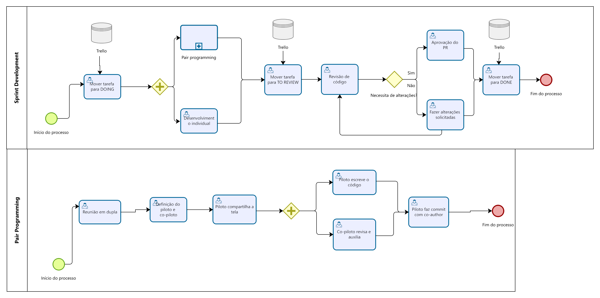

# 1.2. Módulo Processos/Metodologias/Abordagens

## Modelagem BPMN

### 1. Introdução

&emsp;&emsp; A técnica de modelagem do BPMN, é uma notação padronizada para diagramação de fluxos
chamada Business Process Management Notation (BPMN),
sendo essa uma Notação de Gerenciamento de Processos de Negócio.
Esta notação foi adotada pela Object Management Group (OMG).
Trata-se de um consórcio internacional aberto, sem fins lucrativos,
voltado para a padronização de tecnologias.

### 2. Participantes

&emsp;&emsp;Os participantes do desenvolvimento dos diagramas de processos com notação BPMN 2.0 foram:

- Adne Moretti Moreira;
- João Henrique Marques Calzavara;
- Leonardo Milomes Vitoriano;

### 3. Objetivo

&emsp;&emsp;Segundo o Guia da Unb sobre BPMN [1], o objetivo principal desse artefato é é fornecer uma linguagem e notação padronizadas para modelagem e visualização de processos de negócios. O objetivo disso é melhorar a comunicação e a colaboração entre as partes interessadas envolvidas em um processo de negócios, como gerentes, analistas e profissionais de TI.

O BPMN 2.0 fornece uma notação gráfica para processos de modelagem usando símbolos padronizados, formas e linhas de conexão para representar atividades, eventos, gateways e fluxos. Ele permite a modelagem de processos complexos, incluindo atividades paralelas e sequenciais, pontos de decisão e loops, entre outros elementos.

O modelo de processo criado usando BPMN 2.0 pode ser usado para identificar ineficiências, gargalos e outros problemas em um processo de negócios. Ao modelar o processo, as partes interessadas podem identificar áreas para melhoria e otimizar o processo para aumentar a eficiência, reduzir custos e melhorar o desempenho geral.

### 4. Diagramas de processos com notação BPMN 2.0

#### Visão Geral

O diagrama BPMN na figura 1, indica o fluxo das atividades que serão realizadas na disciplina em uma visão geral visando uma construção de um projeto, contendo 2 subprocessos que serão detalhados em outras piscinas, sendo eles: Design Sprint e Sprint.

Cabe ressaltar que a metodologia foi baseada no **Scrum**, pois contém algumas cerimônias apresnetados nele, tais quais a _Sprint_, duração de 1 semana visando incremento contínuo, _Sprint Planning_, planejamento da sprint baseado no _Backlog Sprint_, e _Sprint Review_, revisão da _Sprint_ com os pontos fortes, fracos e melhorias.

Figura 1 - BPMN Visão Geral Autor: Elaboração Própria

  

#### Design Sprint

O diagrama BPMN na figura 2, indica o fluxo das atividades que serão realizadas na fase de Desenho e Modelagem do projeto. Essa fase conta com a elaboração dos artefatos: _Rich Picture_, Léxicos e Mapa mental.

Figura 2 - Design Sprint Autor: Elaboração Própria

  

#### Sprint

O diagrama BPMN na figura 3, indica o fluxo das atividades que serão realizadas em todo o ciclo de vida de desenvolvimento do projeto. A _Sprint_ define tempo e atividades a serem realizadas nele, e ainda existe um subprocesso denominado _Sprint Planning_.

Figura 3 - Sprint Autor: Elaboração Própria

  

#### Sprint Planning

O diagrama BPMN na figura 4, indica o fluxo das atividades que serão realizadas em todo o ciclo de vida de desenvolvimento do projeto. Pois a _Sprint Planning_ visa planejar quem e quais atividades serão desenvolvidas para se obter um incremento do produto.

Figura 4 - Sprint Planning Autor: Elaboração Própria

  

#### Sprint Development

O diagrama BPMN na figura 4, indica de que forma será realizado o desenvolvimento das tarefas durante as sprints.  

Figura 5 - Sprint Development Autor: Elaboração Própria

  

### 4. Reunião

As gravações das reuniões, que ocorreram no dia 22/04/23 ás 12h, de elaboração e desenvolvimento dos artefatos de diagramas de modelagem de processos com notação BPMN 2.0, podem ser encontradas nos links a seguir:

- [Parte 1](https://youtu.be/1-z4lZPubeQ)
- [Parte 2](https://youtu.be/rqhsPMaOj5c)

### 4. Referências

- [1] https://www.dpo.unb.br/images/phocadownload/dpr/biblioteca/BPMN.pdf;
- [2] https://www.omg.org/bpmn/;
- [3] http://iprocess.com.br/notacao-bpmn/;
- [4] https://edisciplinas.usp.br/pluginfile.php/4449285/mod_resource/content/0/Notacao-BPMN%202%20-%202017.pdf;
- [5] [slides da disciplina](https://aprender3.unb.br/pluginfile.php/2482553/mod_label/intro/Arquitetura%20e%20Desenho%20de%20software%20-%20Aula%20BPMN%20Exemplos%20-%20Profa.%20Milene.pdf);

### 5. Histórico de versão

| Versão |                      Alteração                      |    Responsável     |      Revisor       | Data  |
| :----: | :-------------------------------------------------: | :----------------: | :----------------: | :---: |
|  1.0   |  Criação do documento com introdução e referências  |   João Henrique    | Leonardo Vitoriano | 22/04 |
|  1.1   |              Adicionando participantes              |   João Henrique    |        Adne        | 23/04 |
|  1.2   |            Adicionando link das reuniões            |  Marcos Vinícius   |   João Henrique    | 23/04 |
|  1.3   |             Adicionando diagramas BPMN              | Leonardo Vitoriano |   João Henrique    | 23/04 |
|  1.4   | Adicionando objetivo e descrição dos diagramas BPMN | Leonardo Vitoriano |   João Henrique    | 23/04 |
|  1.5   | Adicionando sprint development | Adne Moretti |   João Henrique    | 23/04 |
|  1.6   | Realocando página BPMN | Cícero Fernandes |   Gabriel Moretti    | 23/04 |
