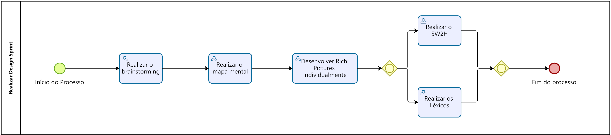

# Modelagem BPMN

## 1. Introdução

&emsp;&emsp; A técnica de modelagem do BPMN, é uma notação padronizada para diagramação de fluxos
chamada Business Process Management Notation (BPMN),
sendo essa uma Notação de Gerenciamento de Processos de Negócio.
Esta notação foi adotada pela Object Management Group (OMG).
Trata-se de um consórcio internacional aberto, sem fins lucrativos,
voltado para a padronização de tecnologias.

## 2. Participantes

Os participantes do desenvolvimento dos diagramas de processos com notação BPM foram:

- Adne Moretti Moreira;
- João Henrique Marques Calzavara;
- Leonardo Milomes Vitoriano;

## 3. Objetivo

## 4. Diagramas de processos com notação BPM 

Figura 1 - BPMN Visão Geral Autor: Elaboração Própria

  

Figura 2 - Design Sprint Autor: Elaboração Própria

  

Figura 3 - Sprint Planning Autor: Elaboração Própria

  

Figura 4 - Sprint Autor: Elaboração Própria

  

## 3. Referências

- https://www.omg.org/bpmn/;
- http://iprocess.com.br/notacao-bpmn/;
- https://edisciplinas.usp.br/pluginfile.php/4449285/mod_resource/content/0/Notacao-BPMN%202%20-%202017.pdf;
- [slides da disciplina](https://aprender3.unb.br/pluginfile.php/2482553/mod_label/intro/Arquitetura%20e%20Desenho%20de%20software%20-%20Aula%20BPMN%20Exemplos%20-%20Profa.%20Milene.pdf);

## 4. Reunião

- [Parte 1](https://youtu.be/1-z4lZPubeQ)
- [Parte 2](https://youtu.be/rqhsPMaOj5c)

## 5. Histórico de versão

| Versão |                     Alteração                     |  Responsável  | Revisor  | Data  |
| :----: | :-----------------------------------------------: | :-----------: | :------: | :---: |
|  1.0   | Criação do documento com introdução e referências | João Henrique | Leonardo Vitoriano | 22/04 |
|  1.1   |             Adicionando participantes             | João Henrique |   Adne   | 23/04 |
|  1.2   |             Adicionando link das reuniões         | Marcos Vinícius |   João Henrique   | 23/04 |
|  1.3   |             Adicionando diagramas BPMN         | Leonardo Vitoriano |   João Henrique   | 23/04 |