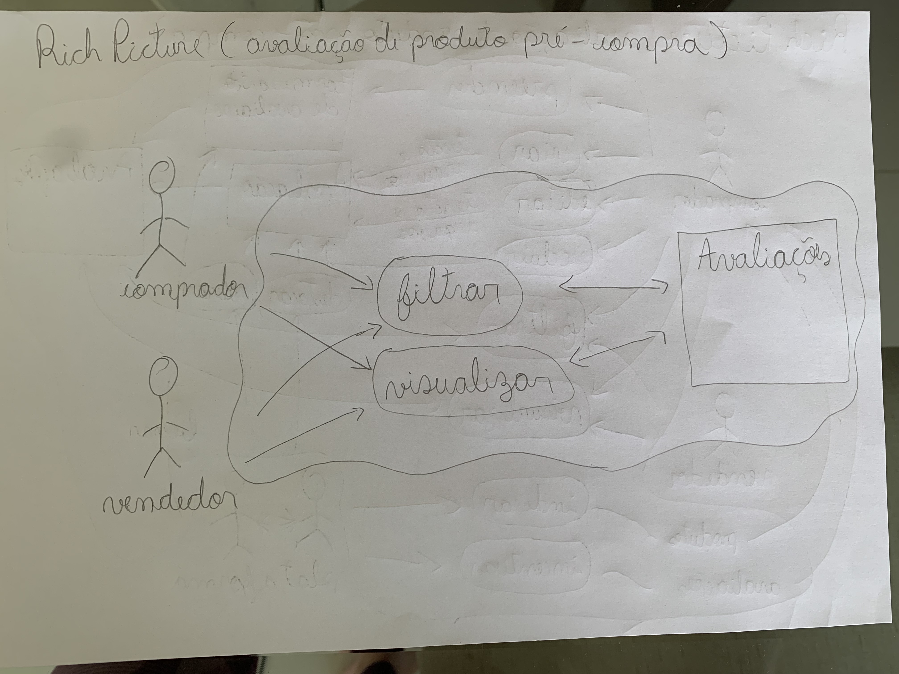

## Introdução
O rich picture é uma ferramenta de pré-rastreabilidade, usada para analisar problemas e idéias de maneira informal.É um desenho de uma situação que ilustra os elementos principais e relações que precisam ser levadas em consideração ao tentar criar alguma melhoria.

## Objetivo 
O objetivo de se fazer o rich picture, é se ter uma melhor idéia do que faremos no decorrer da disciplina, entendendo melhor a visão do comprador e da plataforma sobre o fluxo de avaliações do mercado livre, para isso cada um do grupo fez um rich picture, após isso, depois de analisarmos, fizermos uma versão melhorada com base na análise dos rich pictures de todos, pegamos as idéias onde todos concordamos, e fizemos em um só.

## Rich Picture v1

Com a primeira versão do Rich Picture, denominada v1 (versão 1), foi dessenvolvido utilizando lápis e papel, ou seja, simples o suficiente para visualizar o comportamento do sistema de maneira rápida e com poucos recursos.

A figura 1 ilusta um Rich Picture pré-compra v1.
 

Figura 1 - Rich Picture pré-compra Autor: Leonardo Vitoriano

  

A figura 2 ilusta um Rich Picture pós-compra v1.
 

Figura 2 - Rich Picture pró-compra Autor: Leonardo Vitoriano

figura3
 

Figura 3 - Rich Picture  Autor: João Henrique

figura4
 

Figura 4 - Rich Picture  Autor: Thiago Gomes

figura5
 

Figura 5 - Rich Picture  Autor: Marcos Vinícius

figura6
 

Figura 6 - Rich Picture  Autor: Gabriel Souza

Figura 6 - Rich Picture  Autor: Adne Moretti

Figura 6 - Rich Picture  Autor: Letícia Aires

Figura 6 - Rich Picture  Autor: Cícero Filho

## Referências
- "Introducing Rich Pictures - Rich Picture Drawing Guidelines" - Software Development Project
- MONK, Andrew; HOWARD, Steve. "The Rich Picture: A Tool for Reasoning About Work Context". 1998

## Histórico de Versão

| Versão |      Alteração       |                Responsável                 |    Revisor    | Data  |
| :----: | :------------------: | :----------------------------------------: | :-----------: | :---: | 
| 1.0    | Criando documento e adicionando rich picture v1   | Leonardo Vitoriano | - | 20/04 |
| 1.1    | Adicionando "Introdução", "Objetivos" e mais rich pictures   | João Henrique | - | 21/04 |
| 1.2    | Corrigindo link e adicionando rich pictures   | Adne Moretti | - | 21/04 |
