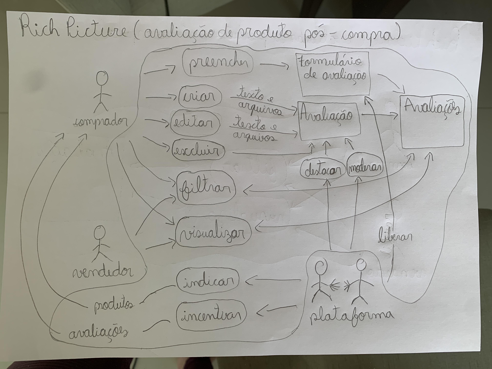

## Introdução

## Objetivo 

## Rich Picture v1

Com a primeira versão do Rich Picture, denominada v1 (versão 1), foi dessenvolvido utilizando lápis e papel, ou seja, simples o suficiente para visualizar o comportamento do sistema de maneira rápida e com poucos recursos.

A figura 1 ilusta um Rich Picture pré-compra v1.
 

Figura 1 - Rich Picture pré-compra Autor: Leonardo Vitoriano

  

A figura 2 ilusta um Rich Picture pós-compra v1.
 

Figura 2 - Rich Picture pró-compra Autor: Leonardo Vitoriano

## Histórico de Versão

| Versão |      Alteração       |                Responsável                 |    Revisor    | Data  |
| :----: | :------------------: | :----------------------------------------: | :-----------: | :---: | 
| 1.0    | Criando documento e adicionando rich picture v1   | Leonardo Vitoriano | - | 20/04 |
