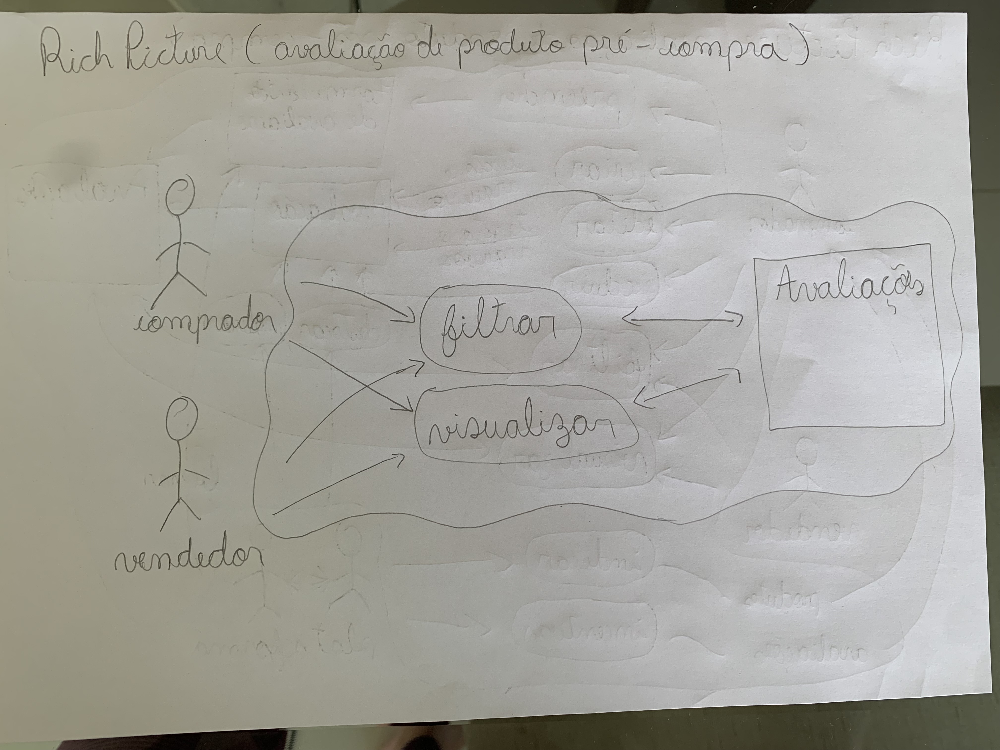
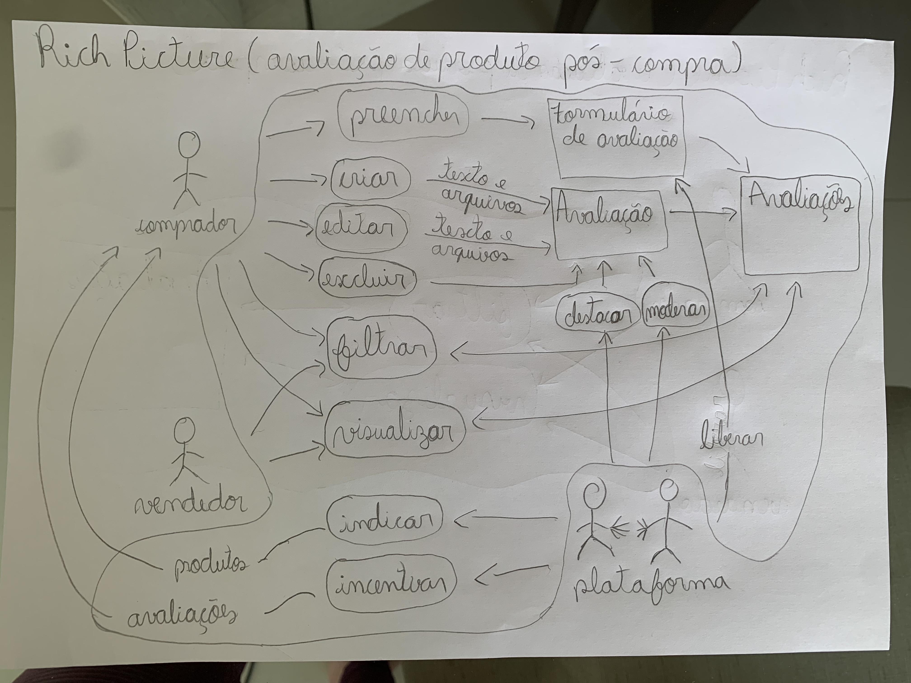
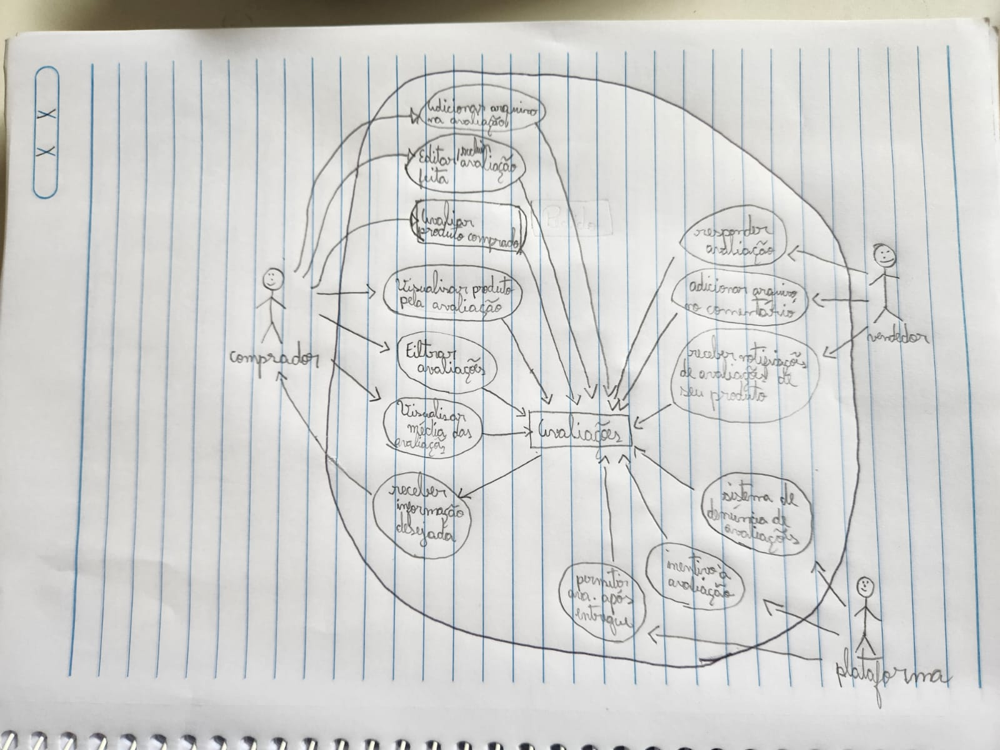
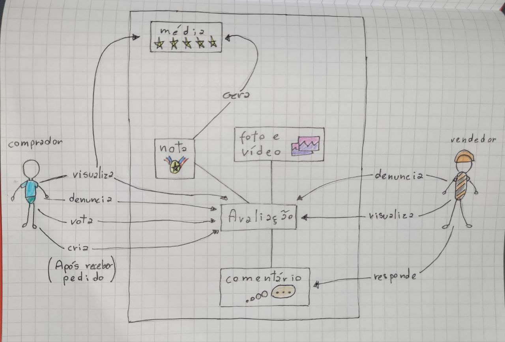
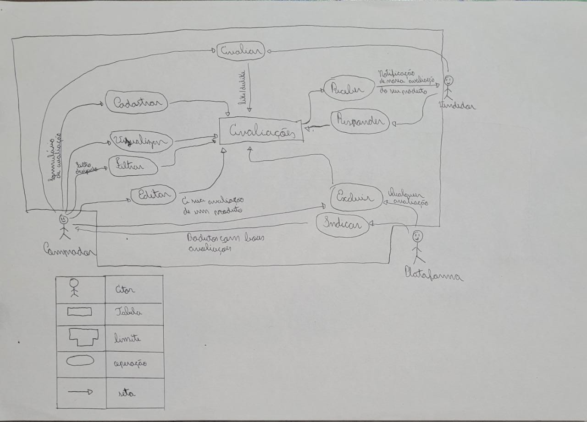
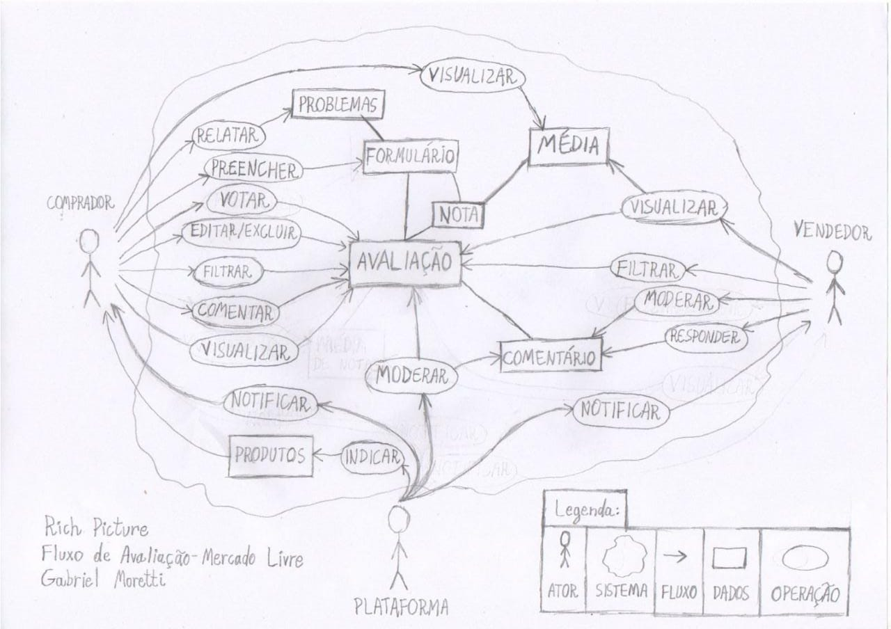
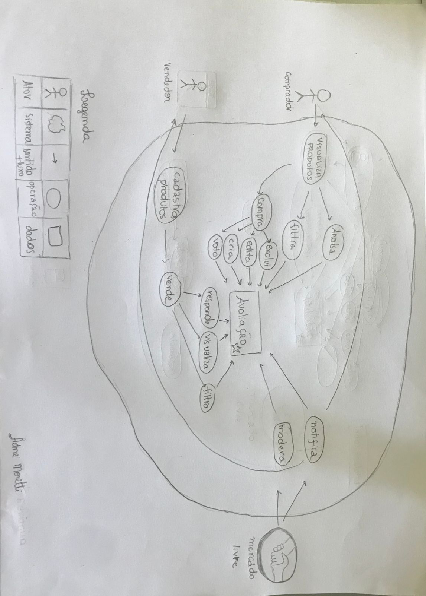
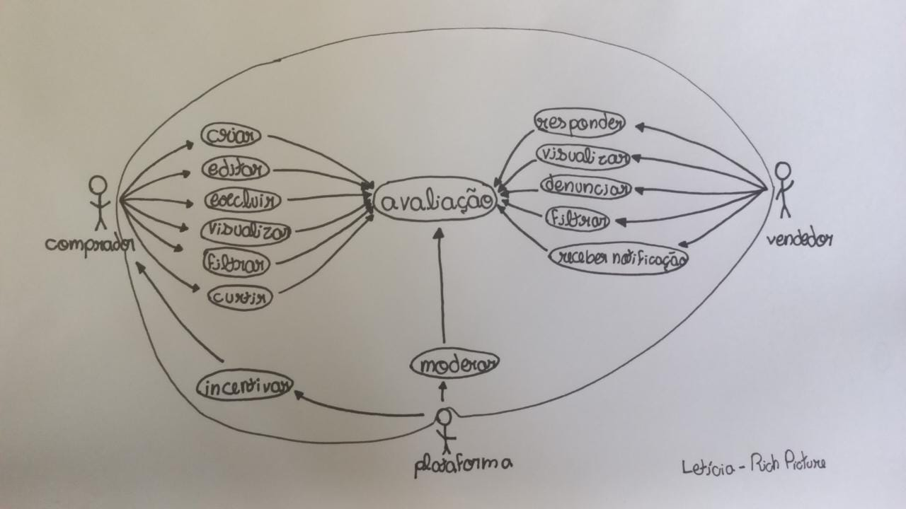
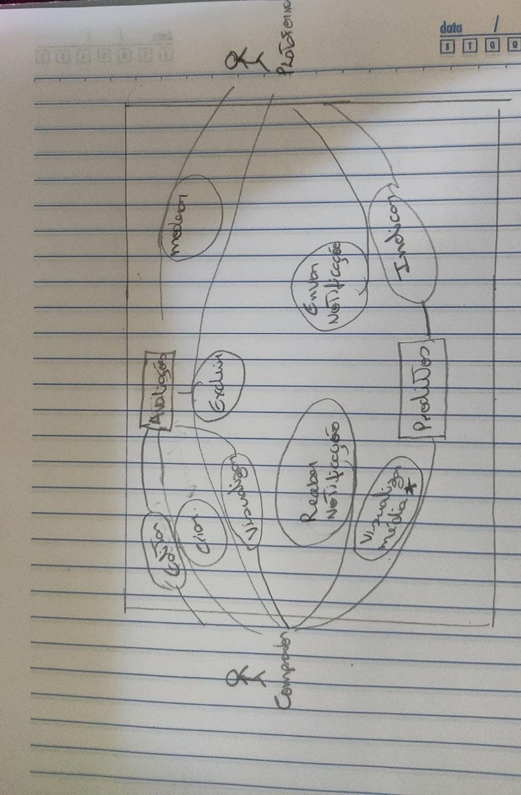
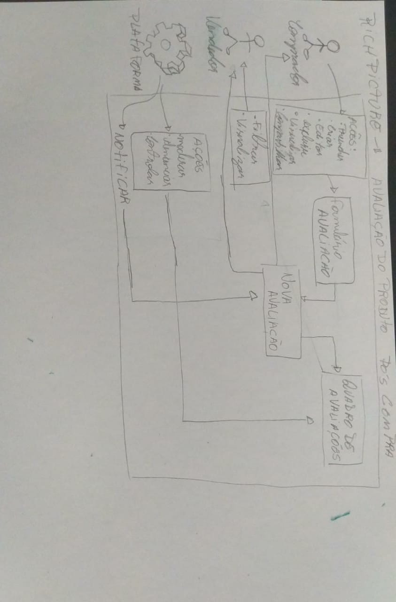

## 1. Introdução
&emsp;&emsp;O rich picture é uma ferramenta de pré-rastreabilidade, usada para analisar problemas e ideias de maneira informal.É um desenho de uma situação que ilustra os elementos principais e relações que precisam ser levadas em consideração ao tentar criar alguma melhoria.

## 2. Objetivo 
&emsp;&emsp;O objetivo de se fazer o rich picture é se ter uma melhor ideia do que faremos no decorrer da disciplina, entendendo melhor a visão do comprador e da plataforma sobre o fluxo de avaliações do mercado livre, para isso cada um do grupo fez um rich picture, após isso, depois de analisarmos, fizermos uma versão melhorada com base na análise dos rich pictures de todos, pegamos as ideias onde todos concordamos, e fizemos em um só.

## 3. Rich Picture v1

&emsp;&emsp;Com a primeira versão do Rich Picture, denominada v1 (versão 1), foi desenvolvido utilizando lápis e papel, ou seja, simples o suficiente para visualizar o comportamento do sistema de maneira rápida e com poucos recursos.

#### Rich picture 1
 

Figura 1 - Rich Picture pré-compra Autor: Leonardo Vitoriano

  

#### Rich picture 2
 

Figura 2 - Rich Picture pró-compra Autor: Leonardo Vitoriano

#### Rich picture 3
 

Figura 3 - Rich Picture  Autor: João Henrique

#### Rich picture 4
 

Figura 4 - Rich Picture  Autor: Thiago Gomes

#### Rich picture 5
 

Figura 5 - Rich Picture  Autor: Marcos Vinícius

#### Rich picture 6
 

Figura 6 - Rich Picture  Autor: Gabriel Souza

#### Rich picture 7

Figura 7 - Rich Picture  Autor: Adne Moretti

#### Rich picture 8

Figura 8 - Rich Picture  Autor: Letícia Aires

#### Rich picture 9

Figura 9 - Rich Picture  Autor: Cícero Filho

#### Rich picture 10

Figura 10 - Rich Picture  Autor: Arthur Lima

## 4. Rich Picture V2 

&emsp;&emsp;Após a análise de todos os rich pictures, discutimos, e decidimos nos basear no rich picture 6 do Gabriel, com algumas pequenas alterações. Abaixo, o resultado da segunda versão que foi feita usando a ferramenta "miro".

<iframe width="768" height="432" src="https://miro.com/app/live-embed/uXjVMR5ENS8=/?moveToViewport=13032,512,31426,22365&embedId=126766445987" frameborder="0" scrolling="no" allow="fullscreen; clipboard-read; clipboard-write" allowfullscreen></iframe>

## 5. Gravação da reunião

- https://www.youtube.com/watch?v=-kraAoANN-o

## 6. Referências
- "Introducing Rich Pictures - Rich Picture Drawing Guidelines" - Software Development Project
- MONK, Andrew; HOWARD, Steve. "The Rich Picture: A Tool for Reasoning About Work Context". 1998

## 7. Histórico de Versão

| Versão |      Alteração       |                Responsável                 |    Revisor    | Data  |
| :----: | :------------------: | :----------------------------------------: | :-----------: | :---: | 
| 1.0    | Criando documento e adicionando rich picture v1   | Leonardo Vitoriano | Gabriel | 20/04 |
| 1.1    | Adicionando "Introdução", "Objetivos" e mais rich pictures   | João Henrique | Gabriel | 21/04 |
| 1.2    | Corrigindo link e adicionando rich pictures   | Adne Moretti | Marcos | 21/04 |
| 1.3    | Adicionando rich picture V2  | Adne, Gabriel, João e Marcos | - | 21/04 |
| 1.4    | Adicionando link para gravação da reunião  | Marcos | - | 21/04 |
| 1.5    | Corrigindo erros ortográficos | Cícero | - | 21/04|