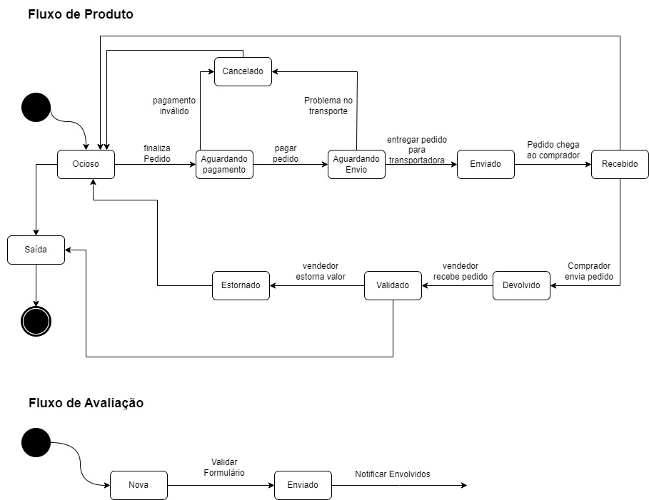
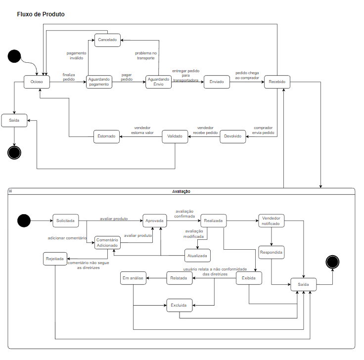

# Diagrama de Estados

## 1. Introdução

&emsp;&emsp; Um diagrama de estados é uma representação visual que descreve os diferentes estados que um objeto ou sistema pode assumir e as transições entre esses estados. É uma ferramenta amplamente utilizada na modelagem e no design de sistemas, auxiliando no entendimento e na comunicação das interações e comportamentos de um sistema.

&emsp;&emsp; O conceito de diagrama de estados é amplamente difundido na área de engenharia de software e engenharia de sistemas. Ele se baseia na ideia de que um sistema pode passar por uma série de estados distintos, e as transições entre esses estados são influenciadas por eventos ou condições específicas. Essa abordagem permite que os desenvolvedores compreendam e documentem de forma clara e concisa o comportamento dinâmico do sistema, facilitando o processo de análise, projeto e implementação.

## 2. Objetivo

&emsp;&emsp; O diagrama de estados pode ajudar a identificar problemas de design em um sistema, permitindo que os desenvolvedores visualizem como o sistema deve se comportar em diferentes situações e identifiquem possíveis problemas de lógica ou desempenho.

&emsp;&emsp; Por fim, o diagrama de estados também pode ser usado para documentar um sistema existente, ajudando a fornecer uma visão geral do comportamento do sistema e facilitando a manutenção e o desenvolvimento futuro. Isso é especialmente útil em sistemas complexos, onde a documentação é fundamental para garantir que o sistema possa ser mantido e expandido com segurança e eficiência.

## 3. Participantes

&emsp;&emsp; Nas reuniões para desenvolvimento do artefato, todos os integrantes do [grupo 2](https://unbarqdsw2023-1.github.io/2023.1_G2_ProjetoMercadoLivre/#/Modelagem/AtaReuniao_0205?id=_3-decis%c3%b5es) que participaram, sendo então os presentes:

- Arthur José Nascimento de Lima
- Leonardo Milomes Vitoriano
- Letícia Assunção Aires Moreira
- Marcos Vinicius de Deus

## 4. Metodologia

&emsp;&emsp; Este artefato foi desenvolvido em conjunto utilizando a ferramente Microsoft Teams para reunião e documentação em forma de vídeo das reuniões. Além das ferramentas [Lucid chart](https://www.lucidchart.com/) e [Draw.io](https://app.diagrams.net/). Como demonstrado na gravação da reunião, um participante compartilhou a tela da ferramenta enquanto o restante do grupo discutia sobre possibilidades e ideias a serem adicionadas no diagrama. Após a criação da primeira versão, com o feedback da professora e do restante do grupo foram feitas melhorias julgadas como necessárias para que o resultado do artefato fosse o melhor possível.

## 5. Artefato 

&emsp;&emsp; O diagrama de estados é uma das ferramentas do Unified Modeling Language (UML) e é usado para modelar o comportamento de um sistema ao longo do tempo, especificamente para objetos que passam por diferentes estados em resposta a eventos. No caso específico da realização de um diagrama de estados para representar os fluxos de avaliação e produto de uma compra no Mercado Livre, realizamos reuniões com os integrantes do grupo para obter uma compreensão completa dos processos envolvidos. Assim conseguimos identificar e definir os diferentes estados pelos quais o objeto de compra passa, bem como os eventos que desencadeiam as transições entre esses estados.

&emsp;&emsp;Em seguida, Identificamos o Estado chave dos estados que envolvem a compra e ele é o "Recebido", que possibilita a realização do fluxo principal que estamos trabalhando, o de avaliação do produto, assim novos eventos foram identificados para a avaliação de um produto no mercado livre como "Solicitada", "Aprovada", "Realizada", "Vendedor notificado", "Comentário Adicionado", "Rejeitada", "Em análise", "Relatada", "Exibida", "Respondida", "Excluida".

<figcaption align='center'>
    <b>Figura 1: Versão inicial do diagrama de estados</b>
     <small>Fonte: Elaboração Própria</small>
</figcaption> 

&emsp;&emsp; O primeiro passo na criação do diagrama de estados é identificar os estados relevantes para a compra no Mercado Livre. Por exemplo, podemos ter os estados "Ocioso", "Aguardando pagamento", "Aguardando envio", "Enviado", "Recebido", "Devolvido", "Validado", "Estornado". Cada estado representa uma etapa específica do processo de compra do produto.

<figcaption align='center'>
    <b>Figura 1: Segunda versão do diagrama de estados</b>
     <small>Fonte: Elaboração Própria</small>
</figcaption> 

&emsp;&emsp; Em seguida, Identificamos o Estado chave dos estados que envolvem a compra e ele é o "Recebido", que  possibilita a realização do fluxo principal que estamos trabalhando, o de avaliação do produto, assim novos eventos foram  identificados para a avaliação de um produto no mercado livre como "Solicitada", "Aprovada", "Realizada", "Vendedor notificado", "Comentário Adicionado", "Rejeitada", "Em análise", "Relatada", "Exibida", "Respondida", "Excluida".

&emsp;&emsp; Uma vez que os estados e os eventos tenham sido identificados, podemos criar as transições entre os estados. Cada transição é rotulada com o evento correspondente que a desencadeia. Por exemplo, a transição do estado "Enviado" para "Recebido" pode ser rotulada com o evento "Pedido chega ao comprador".

&emsp;&emsp; É importante ressaltar que o diagrama de estados é apenas uma das muitas ferramentas oferecidas pelo UML para modelagem de sistemas. Ele fornece uma visão de alto nível do comportamento do sistema, permitindo uma compreensão mais clara e uma base sólida para o desenvolvimento de software.

Segue o Diagrama De Estados versão Final:

<iframe allowfullscreen frameborder="0" style="width:640px; height:480px" src="https://lucid.app/documents/embedded/06f05d2e-62cb-4351-a339-0fa45449264d" id="BvjYAfOoeRZi"></iframe>

<figcaption align='center'>
    <b>Figura 3: Versão final do diagrama de estados</b>
     <small>Fonte: Elaboração Própria</small>
</figcaption> 

&emsp;&emsp; Para elaboração da versão final, fizemos alguns ajustes na versão 2, principalmente a adição das notações de "choice", "fork" e "join". 

## 6. Gravacao da reuniao

[Parte 1](https://youtu.be/akzOE3aZSD8)

[Parte 2](https://youtu.be/4zM3j9VmZQY)

## 7. Conclusão

&emsp;&emsp; O diagrama de estados foi feito detalhando o fluxo de avaliação de produto desde a compra, possibilitando assim uma melhor compreensão do sistema, mapeando os estados válidos e como chegar neles.

&emsp;&emsp; Foi um diagrama importante pois forneceu uma representação visual dos estados que antes podiam ser confundidos ou até esquecidos, já que é um fluxo relativamente complexo. Por exemplo o fluxo de avaliação pode chegar ao seu estado final de diversas formas diferentes, e este artefato ajuda muito nesse ponto.

## 8. Referências

- [1] https://www.lucidchart.com/pages/uml-state-machine-diagram
- [2] https://www.uml-diagrams.org/state-machine-diagrams-reference.html

## 9. Histórico de Versão

| Versão |      Alteração       |                Responsável                 |    Revisor    | Data  |
| :----: | :------------------: | :----------------------------------------: | :-----------: | :---: | 
| 1.0 | Adição dos tópicos Objetivos e Participantes  | Leonardo Vitoriano | Marcos Vinícius | 14/05 |
| 1.1 | Adição dos tópicos Introdução e Gravação da reunião  | Marcos Vinícius | Arthur José | 14/05 |
| 1.2 | Adição do tópico Conclusão  | Christian Siqueira | Arthur José | 15/05 |
| 1.3 | Atualização do tópico Participantes  | Christian Siqueira | MArcos Vinícius | 14/05 |
| 1.4 | Adição dos artefato diagrama de estados  | Arthur José  | Marcos Vinícius | 15/05 |
| 1.5 | Adição do versionamento do diagrama de estados  | Marcos Vinícius  | Arthur José | 15/05 |

