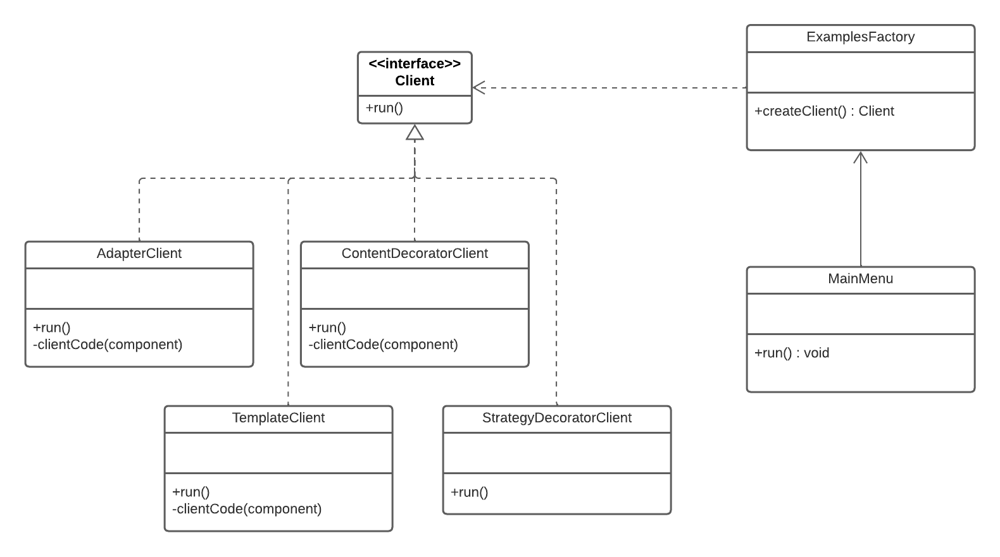

# Injeção de Dependência e Factory

## Introdução
Para criação de um menu contendo os códigos de todos os outros design patterns agrupados, foi utilizado os Padrões de Projeto Injeção de Dependência e Factory. A adoção destes Padrões em conjunto possiblilitou um código que reune a execução dos diferentes Padrões de Projeto adotados, sem a necessidade de multiplas condicionais.

## Padrão Injeção de Dependências
O padrão Injeção de Dependências (Dependency Injection) é um padrão de projeto que visa remover a responsabilidade de criar e gerenciar as dependências de uma classe, transferindo essa responsabilidade para um componente externo. Em vez de uma classe criar diretamente as suas dependências, elas são injetadas na classe por meio de construtores, métodos ou propriedades.

## Padrão Factory
O padrão Factory é um padrão de projeto criacional que encapsula a lógica de criação de objetos em uma classe separada, permitindo que as subclasses decidam quais objetos concretos criar. O objetivo do padrão Factory é fornecer uma interface para criar objetos, ocultando os detalhes de criação e fornecendo flexibilidade para adicionar novos tipos de objetos no futuro.

## Participantes
Os participantes da criação do artefato de injeção de dependência foram:

- Christian Fleury Alencar de Siqueira

## Metodologia
- Foi criado um diagrama dos Padrões de Projeto utilizado, em seguida foi implementado um código com o Menu da aplicação com o Padrão Injeção de Dependencias e Factory. Para a implementação do Padrão Injeção de Dependência foi utilizada a bibliotéca "inversify".

## UML

Na imagem 1 está o diagrama do Menu que foi implementado utilizando os dois Padrões de Projeto.

## Código
A implementação conjunta dos padrões Injeção de Dependências e Factory ocorre nos seguintes arquivos: "container.js", "ExamplesFactory.js" e "MainMenu.js".

No arquivo container.js, é definido um container utilizando a biblioteca inversify, que é uma implementação do padrão Injeção de Dependências para JavaScript. Nele, são registradas as dependências das implementações concretas de "Client" por meio do token "ClientsToken", como é possível visualizar na imagem 2. Cada implementação é associada a um nome específico "AvailableChoices" usando o método "whenTargetNamed".

No arquivo "ExamplesFactory.js", a classe "ExamplesFactory" é responsável por criar uma instância de "Client" com base no tipo especificado. A dependência de "ClientsToken" é injetada no construtor da "ExamplesFactory", permitindo que a implementação correta de "Client" seja resolvida a partir do container. Isso é possível graças ao uso da Injeção de Dependências fornecida pela biblioteca inversify, na imagem 3 é possível verificar os binds de cada um dos tokens.

No arquivo "MainMenu.js", a classe "MainMenu" utiliza a "ExamplesFactory" para criar uma instância de "Client" com base na escolha do usuário no menu principal. Através da Factory, a implementação correta de "Client" é obtida, permitindo que o método "run()" seja chamado, como mostrado na imagem 4.

Dessa forma, a implementação conjunta dos padrões Injeção de Dependências e Factory no código fornecido promove a modularidade, flexibilidade e reutilização de código, permitindo adicionar facilmente novas implementações de Client e reduzindo o acoplamento entre as classes.

## Conclusão
Em resumo, a utilização do padrão Injeção de Dependências em conjunto com o padrão Factory promove a modularidade, flexibilidade e reutilização de código, reduzindo o acoplamento entre classes e facilitando a adição de novas implementações. Isso resulta em um código mais desacoplado, testável e extensível.

## Referências
Martin Fowler, "Inversion of Control Containers and the Dependency Injection pattern": https://martinfowler.com/articles/injection.html

## Versionamento

| Versão | Alteração | Responsável | Revisor | Data |
| :-: | :-: | :-: | :-: | :-: |
|  1.0   | Adiciona de injeção de dependencias| Thiago Gomes  |  Christian Fleury  | 11/06/23  |