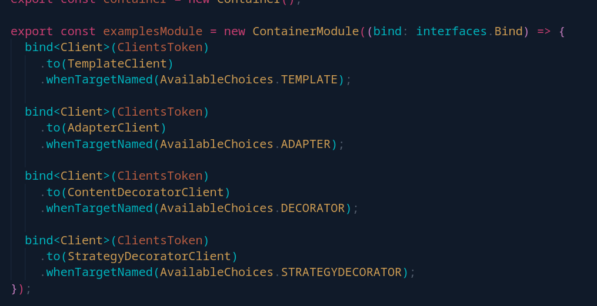
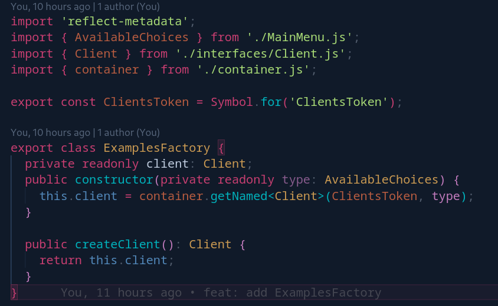
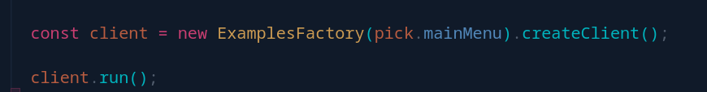

# Injeção de Dependência

## Introdução
O padrão de projeto Injeção de Dependências é um padrão de design que promove a inversão de controle e separação de responsabilidades ao remover a criação e resolução de dependências de dentro de uma classe e fornecer essas dependências de fora. Isso permite que as classes sejam mais flexíveis, testáveis e desacopladas de suas dependências.

## Objetivo
O objetivo do padrão Injeção de Dependências é reduzir o acoplamento entre classes, permitindo que dependências sejam fornecidas de forma flexível e substituíveis. Isso torna o código mais modular, testável e extensível, pois as classes não estão mais diretamente acopladas a implementações específicas de suas dependências.

## Padrão Injeção de Dependências
O padrão Injeção de Dependências (Dependency Injection) é um padrão de projeto que visa remover a responsabilidade de criar e gerenciar as dependências de uma classe, transferindo essa responsabilidade para um componente externo. Em vez de uma classe criar diretamente as suas dependências, elas são injetadas na classe por meio de construtores, métodos ou propriedades.

## Padrão Factory
O padrão Factory é um padrão de projeto criacional que encapsula a lógica de criação de objetos em uma classe separada, permitindo que as subclasses decidam quais objetos concretos criar. O objetivo do padrão Factory é fornecer uma interface para criar objetos, ocultando os detalhes de criação e fornecendo flexibilidade para adicionar novos tipos de objetos no futuro.

## Participantes
Os participantes da criação do artefato de injeção de dependência foram:

- Christian Fleury Alencar de Siqueira
- Cícero Barrozo Fernandes Filho
- Thiago Siqueira Gomes

## Metodologia

## Problemática e Solução

## UML

## Código
A implementação conjunta dos padrões Injeção de Dependências e Factory ocorre nos seguintes arquivos: "container.js", "ExamplesFactory.js" e "MainMenu.js".

No arquivo container.js, é definido um container utilizando a biblioteca inversify, que é uma implementação do padrão Injeção de Dependências para JavaScript. Nele, são registradas as dependências das implementações concretas de "Client" por meio do token "ClientsToken". Cada implementação é associada a um nome específico "AvailableChoices" usando o método "whenTargetNamed".

No arquivo "ExamplesFactory.js", a classe "ExamplesFactory" é responsável por criar uma instância de "Client" com base no tipo especificado. A dependência de "ClientsToken" é injetada no construtor da "ExamplesFactory", permitindo que a implementação correta de "Client" seja resolvida a partir do container. Isso é possível graças ao uso da Injeção de Dependências fornecida pela biblioteca inversify.

No arquivo "MainMenu.js", a classe "MainMenu" utiliza a "ExamplesFactory" para criar uma instância de "Client" com base na escolha do usuário no menu principal. Através da Factory, a implementação correta de "Client" é obtida, permitindo que o método "run()" seja chamado.

Dessa forma, a implementação conjunta dos padrões Injeção de Dependências e Factory no código fornecido promove a modularidade, flexibilidade e reutilização de código, permitindo adicionar facilmente novas implementações de Client e reduzindo o acoplamento entre as classes.

## Conclusão

## Referências
Martin Fowler, "Inversion of Control Containers and the Dependency Injection pattern": https://martinfowler.com/articles/injection.html

## Versionamento

| Versão | Alteração | Responsável | Revisor | Data |
| :-: | :-: | :-: | :-: | :-: |
|  1.0   | Adiciona de injeção de dependencias| Thiago Gomes  |  Christian Fleury  | 11/06/23  |