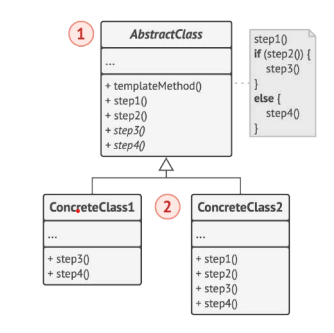
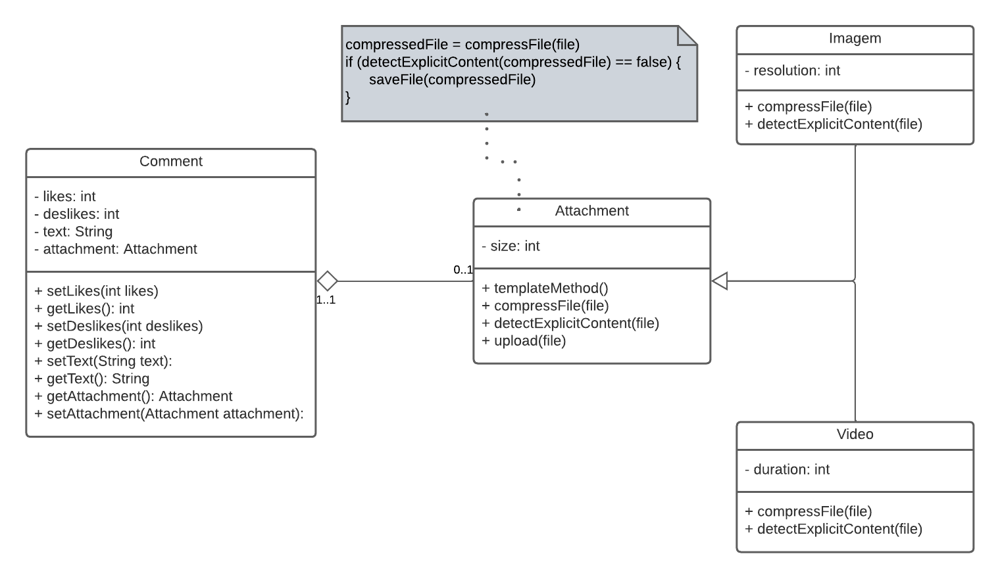

# GoF Template

## Introdução

&emsp;&emsp; O Template Method é um padrão de projeto comportamental que define o esqueleto de um algoritmo na superclasse mas deixa as subclasses sobrescreverem etapas específicas do algoritmo sem modificar sua estrutura. [1]

&emsp;&emsp;O método template, possui a seguinte estrutura:

<figcaption align='center'>
    <b>Figura 1:
     Estrutura do Template Method</b>
     <small>Fonte: Mergulho nos padrões de projeto de Alexander Shvets</small>
</figcaption> 

## Objetivo

&emsp;&emsp; A ideia de se usar o padrão do **Template Method** é de quebrar o algoritmo em uma série de etapas, transformando essas etapas em métodos, e colocando uma série de chamadas para esses métodos dentro de um único método padrão. As etapas podem ser tanto abstratas, ou ter alguma implementação padrão. [2]

## Participantes

Nas reuniões para desenvolvimento do artefato, os integrantes do **grupo 2** que participaram foram:

- Christian Fleury Alencar Siqueira
- Gabriel Moretti de Souza
- João Henrique Marques Calzavara
- Thiago Siqueira Gomes

## Metodologia

&emsp;&emsp; Para se construir o artefato, utilizamos a metodologia de nos reunir via discord e via teams, com os integrantes do grupo, com alguém compartilhando a tela, e todos discutindo sobre como ficaria o artefato utilizando o _Template Method_, fizemos um diagrama de classes para esse método, e após isso, o implementamos em código.

## Problemática e Solução

A problemática que possibilitou a aplicação dos padrões de projeto no fluxo de avaliação do Mercado Livre foi a funcionalidade de compressão de arquivos para sua persistência no banco de dados da aplicação, que seria derivada do anexo de arquivos em um comentário da avaliação. 

Ao observar a funcionalidade no sistema em questão foi possível elencar as diferentes possibilidades de compressão, sendo elas: 

- Imagem: onde a imagem é comprimida utilizando, possivelmente, uma aplicação do código de Huffman, e logo após é validada para verificar a existência de dados maléficos e, finalmente, salva no banco; 
- Vídeo: de modo parecido à compressão de imagens, mas com sua etapa de compressão e validação alteradas para possibilitar a compressão de cada frame do vídeo;

A partir dessa funcionalidade, foi elencada a possibilidade de criação de um padrão Template Method para realizar a alteração de apenas duas das etapas de upload do arquivo ao banco de dados: compressão e validação.

## UML

<figcaption align='center'>
    <b>Figura 2:
     Diagrama do template method para a compressão de arquivo</b>
     <small>Fonte: Elaboração Própria</small>
</figcaption> 

## Código

&emsp;&emsp; O código referente a uma representação _toy_ do **Template Method** para comprimir conteúdo que será utilizado em nosso projeto pode ser encontrado no seguinte endereço web, como parte do menu de códigos _toy_ realizados para outros padrões do projeto:

[Template Method](https://github.com/UnBArqDsw2023-1/2023.1_G2_ProjetoMercadoLivre/tree/design-patterns/src/template)

## Gravação da reunião

[Link da Reunião](https://www.youtube.com/watch?v=wuYSZUKnArc)

## Conclusão

## Referências

- [1] Mergulho nos padrões de projeto de Alexander Shvets
- [2] https://refactoring.guru/pt-br/design-patterns/decorator

## Versionamento

| Versão |                        Alteração                        |  Responsável  | Revisor | Data  |
| :----: | :-----------------------------------------------------: | :-----------: | :-----: | :---: |
|  1.0   |                   Criando Introdução                    | João Henrique |    Gabriel    | 11/06 |
|  1.1   | Adicionando Participantes, Metodologia, Objetivos e UML | João Henrique |    Gabriel    | 11/06 |
|  1.2   |                   Adicionando código                    | João Henrique |    Gabriel    | 11/06 |
|  1.3   | Adição da gravação e problemática | Gabriel |  -   | 11/06/2023 |
