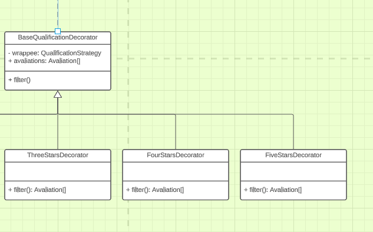

# GRASP Especialista

## Introdução

&emsp;&emsp; O padrão Especialista em Informação (Information Expert) é um princípio do GRASP que tem como objetivo atribuir a responsabilidade de realizar determinada tarefa a uma classe que possua o conhecimento e as informações necessárias para executá-la. O Especialista em Informação foca na colocação da responsabilidade em um objeto que tenha acesso direto aos dados relevantes para realizar uma determinada operação.

## Objetivo
&emsp;&emsp; O objeto tem como objetivo delegar uma atividade para uma entidade que tem certo grau de especialidade em algo. Como delegar a melhor entidade para fazer certo cálculo, entre outros exemplos.

## Participantes

- Adne Moretti Moreira
- Arthur José Nascimento de Lima
- Cícero Barrozo Fernandes Filho
- Gabriel Moretti de Souza
- João Henrique Marques Calzavara
- Leonardo Milomes Vitoriano
- Marcos Vinicius de Deus
- Thiago Siqueira Gomes

## Metodologia

&emsp;&emsp; Para se construir o artefato, utilizamos a metodologia de nos reunir via discord e via teams, com os integrantes do grupo, discutimos onde, nos nossos [padrões GoFs](/docs/PadroesDeProjeto/3.2.GoFs.md) utilizamos o especialista e demonstramos aqui os resultados dessas discussões.

## Resultado

&emsp;&emsp; O especialista foi encontrado no decorator em que seriam admitidos para cada decorator concreto, uma atividade específica, no caso, filtrar por uma determinada quantidade de estrelas.

<figcaption>
    <b>Figura 1:
     Primeiro exemplo de especialista</b>
</figcaption> 

É possível visualizar a solução pela lógica do código também, onde o BaseQualificationDecorator delega funções para as classes de cada nível de estrela.

<figcaption>
    <b>Figura 2:
     O Decorator base que irá delegar as especialidades</b>
</figcaption> 

<figcaption>
    <b>Figura 3:
     Classe de filtro 4 estrelas fazendo sua especialidade</b>
</figcaption> 

<figcaption>
    <b>Figura 4:
     Classe de filtro 5 estrelas fazendo sua especialidade</b>
</figcaption> 

<figcaption>
    <b>Figura 5:
     Classe de filtro 3 estrelas fazendo sua especialidade</b>
</figcaption> 

## Conclusão

&emsp;&emsp; Através do uso do polimorfismo das classes, é possível aferir também o padrão GRASP especialista, onde as classes que herdaram os métodos acabaram se mostrando especialistas a certo ponto, no caso em questão, cada classe tinha a especialidade de fazer o filtro por uma quantidade de estrelas específica.

## Referências

- [1] SERRANO, M. AULA - GRASP – PARTE I.

- [2] SERRANO, M. AULA - GRASP – PARTE II.

## Versionamento

| Versão |                  Alteração                   |    Responsável     |      Revisor       | Data  |
| :----: | :------------------------------------------: | :----------------: | :----------------: | :---: |
|  1.0   | Criação do documento | Adne, Arthur, Cícero, Christian, Gabriel, João, Leonardo, Marcos, Thiago  |  -  | 11/06/2023 |
