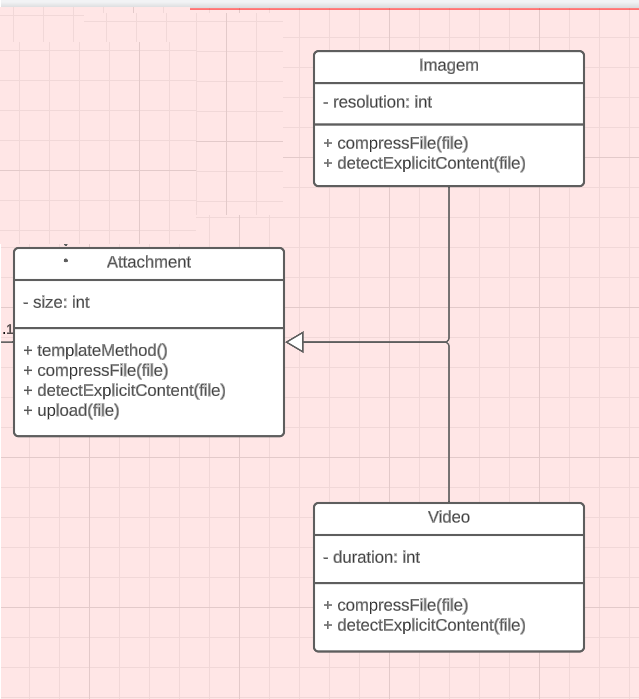
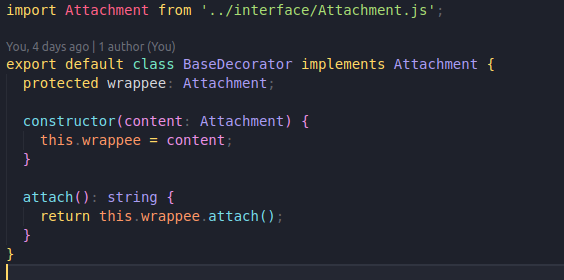
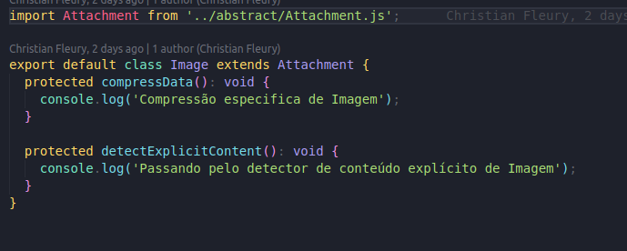

# GRASP polimorfismo

## Introdução

&emsp;&emsp; O padrão Polimorfismo baseia-se no uso de herança e interfaces para permitir que objetos de diferentes classes sejam tratados de forma polimórfica. Ele permite a substituição de objetos em tempo de execução, promovendo a flexibilidade e a reutilização de código.

## Objetivo

Segundo [1], no contexto do GRASP, o polimorfismo é aplicado para atribuir responsabilidades apropriadas aos objetos. Quando um sistema requer comportamentos variáveis que podem ser fornecidos por diferentes classes, o polimorfismo é utilizado para encapsular esses comportamentos em uma interface comum e delegar a responsabilidade aos objetos corretos.

## Participantes

- Adne Moretti Moreira
- Arthur José Nascimento de Lima
- Cícero Barrozo Fernandes Filho
- Gabriel Moretti de Souza
- João Henrique Marques Calzavara
- Leonardo Milomes Vitoriano
- Marcos Vinicius de Deus
- Thiago Siqueira Gomes

## Metodologia

&emsp;&emsp; Para se construir o artefato, utilizamos a metodologia de nos reunir via discord e via teams, com os integrantes do grupo, discutimos onde, nos nossos [padrões GoFs](/docs/PadroesDeProjeto/3.2.GoFs.md) utilizamos o polimorfismo e demonstramos aqui os resultados dessas discussões.

## Resultado

&emsp;&emsp; O polimorfismo foi utilizado em diversos pontos no projeto, um deles foi no [decorator](/docs/PadroesDeProjeto/GOFS/decorator.md) que seguia o fluxo de anexar tipos diferentes de arquivos, onde o método attach foi herdado e sobrescrito em diferentes classes.

<figcaption>
    <b>Figura 1:
     Primeiro exemplo de polimorfismo</b>
</figcaption> 

 

&emsp;&emsp; Outro exemplo de uso do polimorfismo foi no padrão GOF template method, onde dois métodos, compressFile e detectedExplicitContent, que pode ser visualizado na figura 2. 

<figcaption>
    <b>Figura 2:
     Segundo exemplo de polimorfismo</b>
</figcaption> 

&emsp;&emsp; Também é possível visualizar esse polimorfismo a nível de código, sendo as figuras 3 - 6 referente ao polimorfismo no decorator de anexador de conteúdo e as figuras 7 - 9 referente ao polimorfismo no template method.

### POLIMORFISMO DECORATOR

<figcaption>
    <b>Figura 3:
     Exemplo de código polimorfismo Decorator</b>
</figcaption> 

 

<figcaption>
    <b>Figura 4:
     Exemplo de código polimorfismo Decorator PNG</b>
</figcaption> 

 

<figcaption>
    <b>Figura 5:
     Exemplo de código polimorfismo Decorator MP4</b>
</figcaption> 

 

<figcaption>
    <b>Figura 6:
     Exemplo de código polimorfismo Decorator JPEG</b>
</figcaption> 

 

### POLIMORFISMO TEMPLATE METHOD

<figcaption>
    <b>Figura 7:
     Exemplo de código polimorfismo Template method</b>
</figcaption> 

 

<figcaption>
    <b>Figura 8:
     Exemplo de código polimorfismo Template method Video</b>
</figcaption> 

 

<figcaption>
    <b>Figura 9:
     Exemplo de código polimorfismo Template method Imagem</b>
</figcaption> 

 

## Conclusão

&emsp;&emsp; Através do uso do polimorfismo, conseguimos aplicar um dos princípios do GRASP (General Responsibility Assignment Software Patterns), que é atribuir responsabilidades apropriadas aos objetos. O polimorfismo nos permite tratar objetos de diferentes classes de forma polimórfica, o que nos proporciona flexibilidade e reutilização de código.

## Referências

- [1] SERRANO, M. AULA - GRASP – PARTE I.

- [2] SERRANO, M. AULA - GRASP – PARTE II.

## Versionamento

| Versão |                  Alteração                   |    Responsável     |      Revisor       | Data  |
| :----: | :------------------------------------------: | :----------------: | :----------------: | :---: |
|  1.0   | Criação do documento | Adne, Arthur, Cícero, Christian, Gabriel, João, Leonardo, Marcos, Thiago  |  -  | 11/06/2023 |
