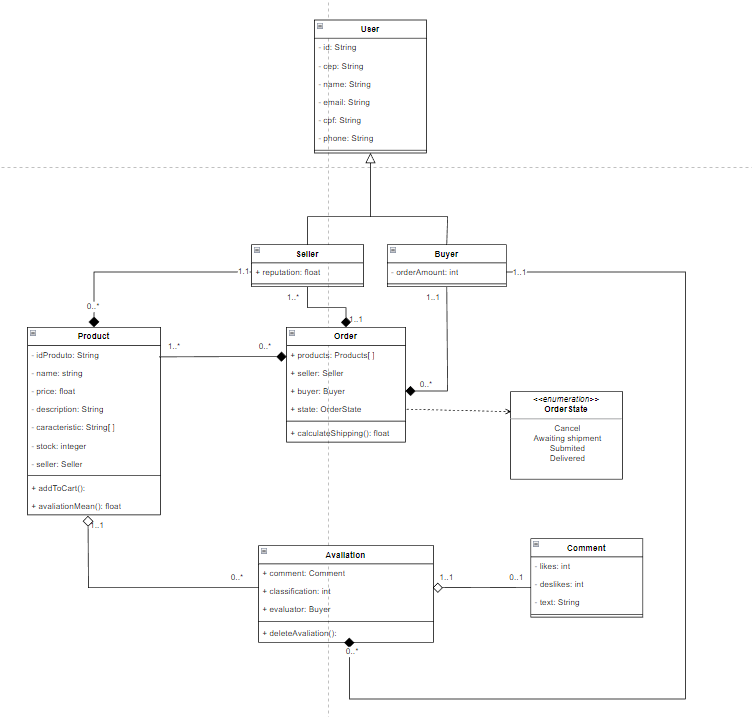
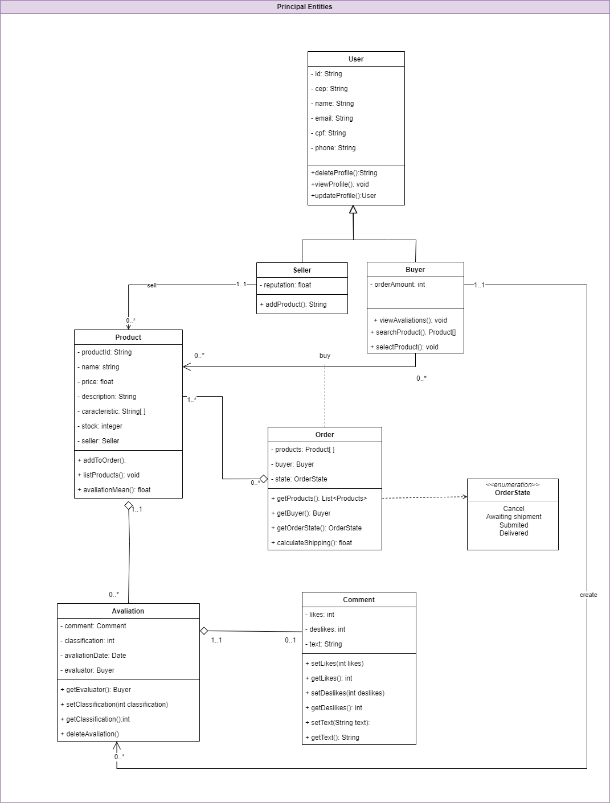

# Melhorias na entrega anterior

## Introdução

&emsp;&emsp; Esse artefato foi criado para documentar de maneira mais clara as melhorias que foram feitas na entrega anterior, de [modelagem](../Modelagem/2.Modelagem.md).

## Metodologia

&emsp;&emsp; Para desenvolver este artefato, toda a equipe discutiu em sala o que fazia sentido ser alterado, após um consenso geral, os integrantes Leonardo Milomes Vitoriano e Adne Moretti Moreira se dispuseram a realizar as melhorias no diagrama e o integrante Marcos Vinícius de Deus documentou essas melhorias com a produção deste artefato.

## O que foi melhorado

&emsp;&emsp; O principal ponto em que focamos nossos esforços para melhoria da entrega passada, foi o [Diagrama de classes](../Modelagem/Estaticos/classes.md). Segue abaixo a comparação da versão que foi entregue anteriormente com a versão que contém as melhorias adicionadas após o feedback da professora na entrega.

<figcaption align='center'>
    <b>Figura 1: Versão 3 do diagrama de classes</b>
     <small>Fonte: Elaboração Própria</small>
</figcaption> 

&emsp;&emsp; Após a apresentação dos artefatos em sala de aula e feedback da entrega por parte da professora, os seguintes pontos de melhora foram elencados:

 - Os métodos no geral, estavam muito brevemente especificados, sem detalhamento nos parâmetros
 - Acoplamento muito alto na classe "Order"
 - Relacionamento de composição entre a classe "Order" e "seller" não parece ser necessário
 - Todos os relacionamentos de composição da classe "Order" podem ser analisados 

&emsp;&emsp; Então, após a análise desses pontos, algumas melhorias foram implementadas e como resultado, segue abaixo a nova versão do diagrama de classes.

<figcaption align='center'>
    <b>Figura 1: Versão 4 do diagrama de classes, após as melhorias</b>
     <small>Fonte: Elaboração Própria</small>
</figcaption> 

## Versionamento

| Versão |                  Alteração                   |    Responsável     |      Revisor       | Data  |
| :----: | :------------------------------------------: | :----------------: | :----------------: | :---: |
|  1.0   | Criação do artefato e adição de todo conteúdo | Marcos Vinícius  |  Cicero  | 12/06 |

