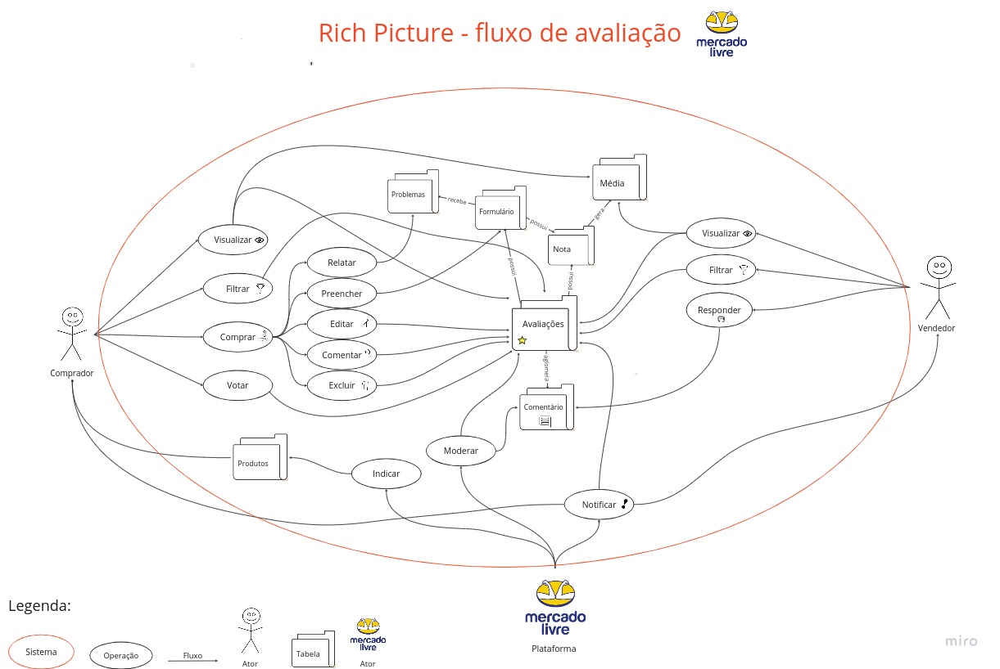

# 2023.1_G2_ProjetoMercadoLivre

**Código da Disciplina**: FGA0208 
**Número do Grupo**: G2 

## Alunos

|                                                      Foto                                                      | Matrícula  |               Aluno               |     Github      |
| :------------------------------------------------------------------------------------------------------------: | :--------: | :-------------------------------: | :-------------: |
|     | 20/0013181 |       Adne Moretti Moreira        |   AdneMoretti   |
|         | 19/0084600 |  Arthur José Nascimento de Lima   |  Arthurlima544  |
|    | 19/0011602 | Christian Fleury Alencar Siqueira |    chfleury     |
|    | 19/0085819 |  Cícero Barrozo Fernandes Filho   |    ciceroff     |
|   | 20/0018205 |     Gabriel Moretti de Souza      |    MorettiGS    |
|       | 20/0067923 |  João Henrique Marques Calzavara  | joao-henrique10 |
|  | 20/1000379 |    Leonardo Milomes Vitoriano     |  leonardomilv3  |
|       | 19/0128712 |  Letícia Assunção Aires Moreira   |  LeticiaAires   |
|     | 20/0062379 |      Marcos Vinicius de Deus      |    Marcos574    |
|  | 15/0141629 |       Matheus Pimentel Leal       |  Matheuspleal   |
|     | 19/0055294 |       Thiago Siqueira Gomes       |     thgomes     |

## Sobre

Contextualize, usando referências, links, e outros materiais como fontes.

## Screenshots Primeira Entrega <<FOCO: DSW(Base)>>

Seguem alguns exemplos de artefatos que foram confeccionados para a primeira entrega (DSW-Base):

### Mapa Mental

### Rich Picture

### Protótipo

## Screenshots Segunda Entrega <<FOCO: DSW(Modelagem)>>

Adicione 2 ou mais screenshots em termos de artefatos da Segunda Entrega.

## Screenshots Terceira Entrega <<FOCO: DSW(Padrões de Projeto)>>

Adicione 2 ou mais screenshots em termos de artefatos da Terceira Entrega.

## Screenshots Quarta Entrega (FINAL) <<FOCOS: Arquitetura & Reutilização de Software & PROJETO FINAL>>

Adicione 2 ou mais screenshots em termos de artefatos da Quarta Entrega.

## Descritivo dos Principais Aspectos Técnicos

**Principal(is) Metodologia(s) Adotada(s)**: xxxxxx 
**Principais Linguagens Utilizadas e/ou Pretendidas**: xxxxxx 
**Principais Tecnologias Utilizadas e/ou Pretendidas**: xxxxxx 
**Principal(is) Estilo(s) Arquitetural(is) Adotado(s)**: xxxxxx 

## Há algo a ser executado?

( ) SIM

( ) NÃO

Se SIM, insira um manual (ou um script) para auxiliar ainda mais os interessados na execução.

## Informações Complementares

Quaisquer outras informações adicionais podem ser descritas nessa seção.
